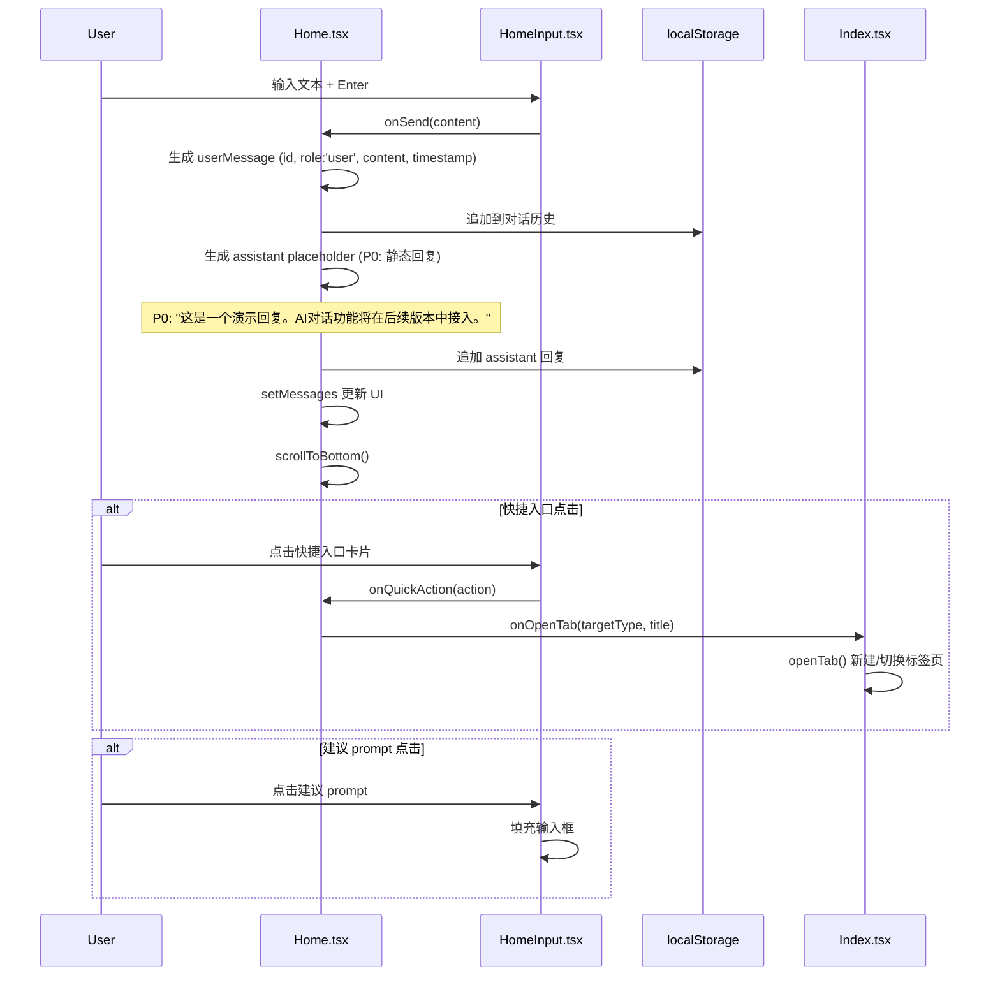
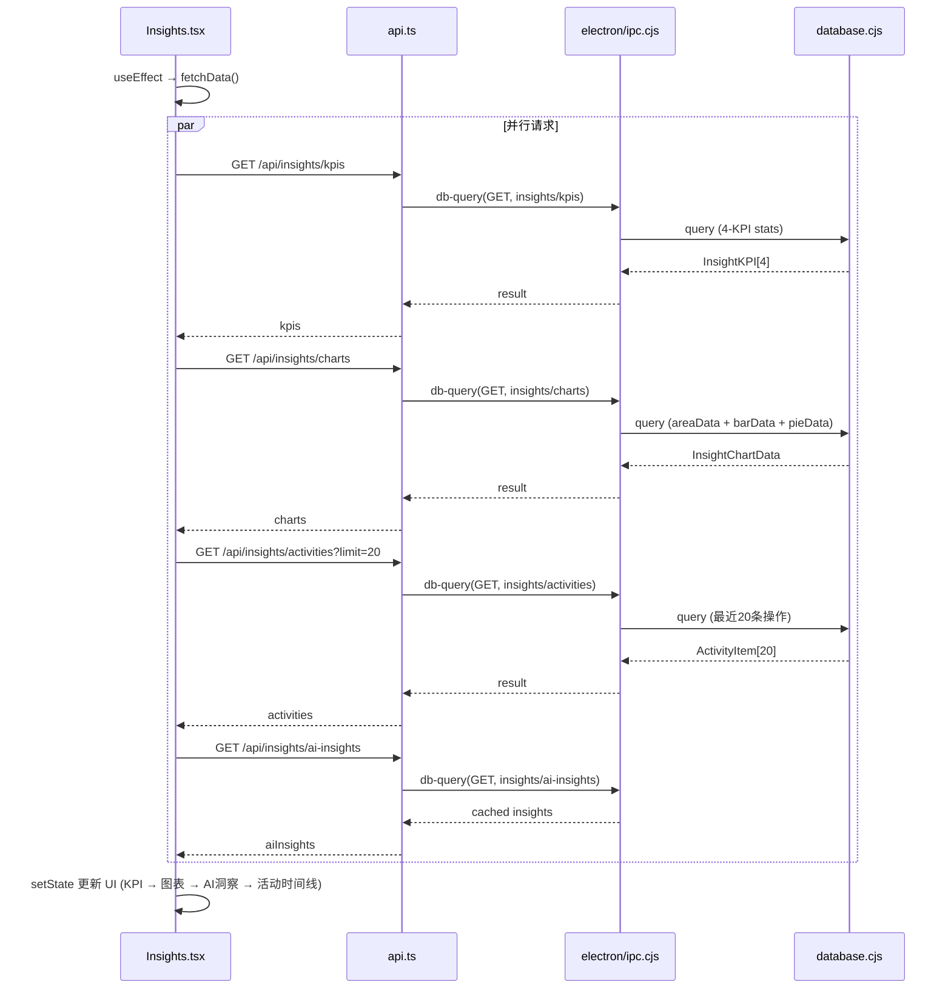
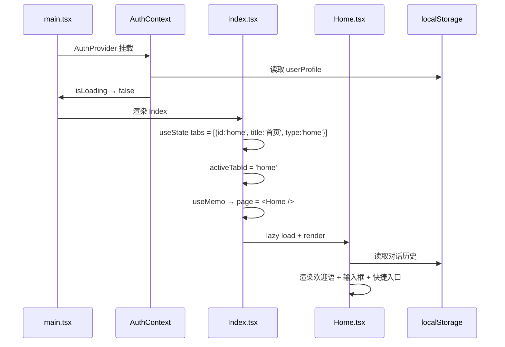
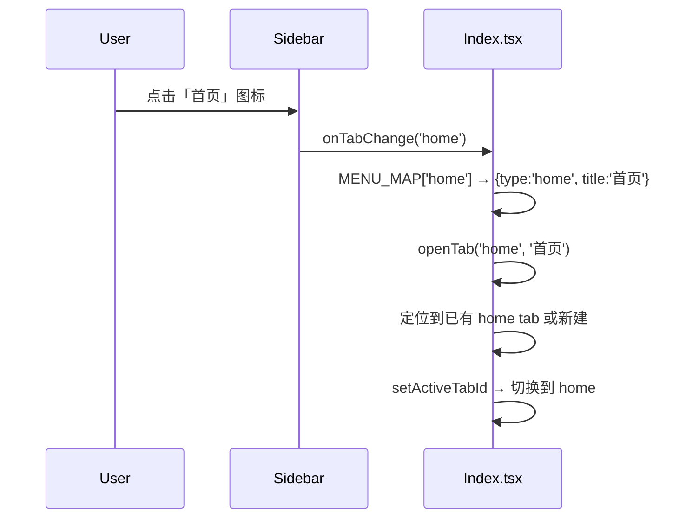
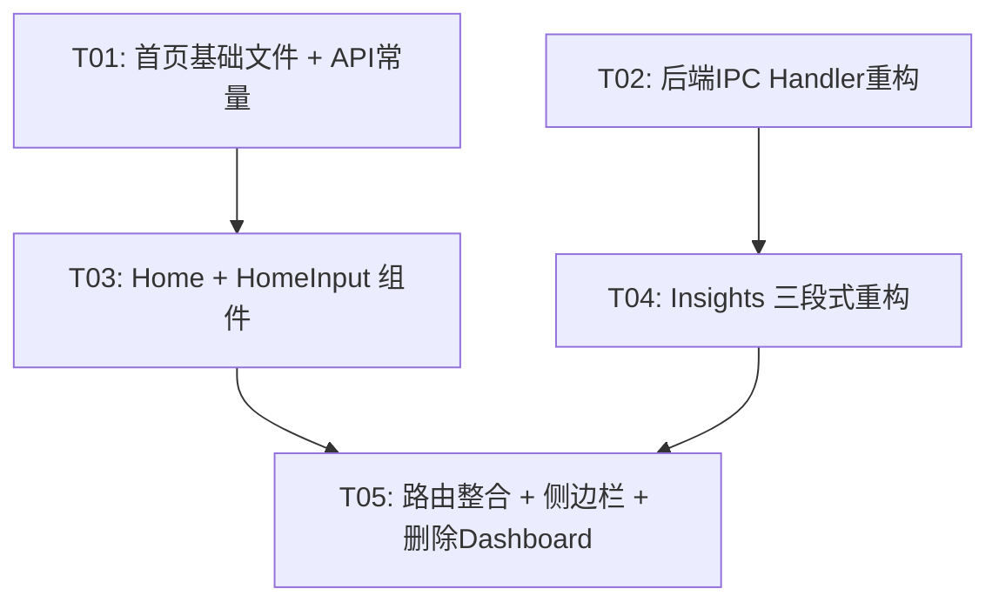

# Workit 首页重设计 & 洞察页整合 — 架构设计

> 架构师：高见远（Bob） | 日期：2025-05-31 | 基于 PRD v1.0

---

## Part A: 系统设计

### 1. Implementation Approach

#### 核心挑战

| 难点 | 方案 |
|------|------|
| **Dashboard 内容无缝迁移至 Insights** | Insights 重构为三段式布局（KPI → 图表 Tab → AI洞察+活动时间线双栏），Dashboard 组件直接删除 |
| **首页对话式 UI** | 纯前端实现 — 对话历史存 localStorage，不接入后端 AI（P0/P1范围）。输入框支持 Enter 提交 / Shift+Enter 换行 |
| **两个来源的图表去重合并** | Dashboard 的 AreaChart + BarChart 与 Insights 的 BarChart + PieChart 合并为一个图表区，用 Tab 切换（活动趋势 / 分类分布 / 文档类型） |
| **路由 & 侧边栏无缝切换** | Index.tsx 默认 tab 从 `dashboard` 改为 `home`，所有 dashboard 引用全局替换 |
| **后端 API 零冗余合并** | 删除 `dashboard/*` 三个 handler，扩展 `insights/*` 三个 handler，数据无中断 |

#### 架构模式

- **前端**：单页 Tab-Based SPA，每个 Tab 对应一个独立 Page 组件，由 `Index.tsx` 的 `GlobalTab[]` 状态管理
- **状态管理**：React Context（AuthContext） + 组件本地 state + localStorage（Home 对话历史）
- **数据流**：Page → `apiFetch()` → Electron IPC → `handleDbQuery()` → SQLite

#### 框架选型（沿用现有）

| 类别 | 选型 | 理由 |
|------|------|------|
| UI 框架 | React 19 + TypeScript | 现有技术栈 |
| 构建 | Vite | 现有 |
| 样式 | Tailwind CSS + CSS Variables | 现有设计系统 |
| 图表 | Recharts（lazy loaded） | 现有，Dashboard/Insights 均已使用 |
| 图标 | Lucide React | 现有，需新增 `HomeIcon` |

---

### 2. File List

#### 新建文件

```
src/pages/Home.tsx                     # 对话式首页（含欢迎语、输入框、对话历史、快捷入口、建议 prompt）
src/components/HomeInput.tsx           # 首页输入框封装（含建议 prompt 联想、快捷入口卡片）
src/data/homeDefaults.ts               # 首页静态配置：建议 prompt 列表、快捷入口列表、欢迎语模板
```

#### 修改文件

```
src/pages/Index.tsx                    # 注册 Home lazy import、默认 tab 改 home、删除 Dashboard 路由、更新 MENU_MAP
src/pages/Insights.tsx                 # 重构为三段式：KPI卡片行 → 图表Tab区 → AI洞察+活动时间线双栏
src/components/Sidebar.tsx             # navItems 顶部新增 home、删除 dashboard
src/api.ts                             # 新增 insightsActivities / insightsCharts 扩展 API 常量（可选：标记 dashboard API deprecated）
electron/ipc.cjs                       # 删除 dashboard/stats、dashboard/charts、dashboard/activities handler；扩展 insights/kpis、insights/charts；新增 insights/activities
electron/database.cjs                  # 无结构变更（仅 IPC 路由调整）
```

#### 删除文件

```
src/pages/Dashboard.tsx                # 功能已迁移至 Home + Insights，直接删除
```

---

### 3. Data Structures and Interfaces

```mermaid
classDiagram
    %% ===== Global Tab System (Index.tsx) =====
    class GlobalTab {
        +string id
        +string title
        +string type
        +number reqId?
        +Record~string,any~ params?
    }

    %% ===== Home Page Types =====
    class HomeMessage {
        +string id
        +string role
        +string content
        +number timestamp
    }

    class QuickAction {
        +string id
        +string label
        +string icon
        +string action
        +string target?
        +string prompt?
    }

    class HomeDefaults {
        +QuickAction[] quickActions
        +string[] suggestedPrompts
        +function getGreeting(name: string): string
    }

    %% ===== Insights Page Types =====
    class InsightKPI {
        +string label
        +string value
        +string change
        +boolean up
        +string icon
        +string color
        +string bg
    }

    class ActivityItem {
        +number id
        +string icon
        +string color
        +string text
        +string time
        +string targetType?
        +number targetId?
    }

    class InsightChartData {
        +AreaData[] areaData
        +BarData[] barData
        +PieData[] pieData
    }

    class AreaData {
        +string name
        +number 需求
        +number 知识
        +number 洞察分析
    }

    class BarData {
        +string name
        +number value
    }

    class PieData {
        +string name
        +number value
    }

    class AIInsight {
        +string title
        +string desc
        +string icon
        +string color
        +string bg
        +number score
    }

    %% ===== Page Components =====
    class HomePage {
        +HomeMessage[] messages
        +string inputValue
        +function handleSend()
        +function handleClearHistory()
        +function handleDeleteMessage(id)
        +function handleQuickAction(action)
        +function handleSuggestedPrompt(prompt)
    }

    class InsightsPage {
        +InsightKPI[] kpis
        +InsightChartData charts
        +AIInsight[] aiInsights
        +ActivityItem[] activities
        +string activeChartTab
        +string activeReport
        +function fetchAllData()
        +function generateAIInsights()
    }

    class SidebarComponent {
        +NavItem[] navItems
        +string activeTab
        +function onTabChange(id)
    }

    class IndexPage {
        +GlobalTab[] tabs
        +string activeTabId
        +function openTab(type, title, extra?)
        +function closeTab(id)
    }

    class NavItem {
        +string id
        +string label
        +LucideIcon icon
        +string color
        +string path
    }

    %% ===== API / IPC =====
    class API {
        +string insightsKpis
        +string insightsCharts
        +string insightsAiInsights
        +string insightsActivities
    }

    class IPC {
        +handle insights/kpis
        +handle insights/charts
        +handle insights/ai-insights
        +handle insights/activities
    }

    %% ===== Relationships =====
    IndexPage "1" --> "*" GlobalTab : manages
    IndexPage "1" --> "1" SidebarComponent : renders
    SidebarComponent "1" --> "*" NavItem : contains
    HomePage ..> HomeMessage : uses
    HomePage ..> QuickAction : uses
    HomePage ..> API : calls (future P2)
    HomePage ..> HomeDefaults : imports
    InsightsPage "1" --> "4" InsightKPI : displays
    InsightsPage "1" --> "1" InsightChartData : displays
    InsightsPage "1" --> "*" AIInsight : displays
    InsightsPage "1" --> "*" ActivityItem : displays
    InsightsPage ..> API : fetches
    API ..> IPC : routes through
    InsightChartData "1" --> "*" AreaData
    InsightChartData "1" --> "*" BarData
    InsightChartData "1" --> "*" PieData
```



---

### 4. Program Call Flow

#### 4.1 首页对话发送流程



#### 4.2 Insights 数据加载流程



#### 4.3 App 启动 & 路由初始化



#### 4.4 侧边栏导航点击流程



---

### 5. Anything UNCLEAR

| # | 问题 | 假设 |
|---|------|------|
| 1 | 首页对话 P0 是否需要后端 AI？ | **不接入**。P0 做 UI 框架 + 本地历史存储；P2 再接入 AI。assistant 回复使用静态占位文本模拟。 |
| 2 | 活动时间线点击跳转逻辑 | **保留交互**。迁移后的 ActivityItem 增加 `targetType`/`targetId`，点击跳转到对应需求详情页（复用原 Dashboard `onOpenSubTab` 逻辑）。Insights 需要新增 `onOpenSubTab` prop。 |
| 3 | 图表区默认 Tab | 「活动趋势」（AreaChart）作为默认 Tab。 |
| 4 | 侧边栏 8 个图标 + Home 是否拥挤 | 当前 52px 窄栏放 7 个图标 + 设置 + 用户，新增 Home 后为 8 个图标。间距从 `gap-1`（4px）可微调为 `gap-0.5`（2px）或缩减 padding。**假设：不做调整，先保持现有间距**，若体验不佳后续迭代。 |
| 5 | 对话历史持久化 | **localStorage** 足够（P0/P1范围）。多设备同步不在范围内。 |
| 6 | 快捷入口数量 | 保持 PRD 定义的 4 个（采集需求、知识库、需求分析、模型配置）。MCP 工具暂不加入。 |
| 7 | Welcome 向导后默认 tab | 向导完成后当前逻辑 openTab('profile', '用户信息')，但首次启动默认 tab 已是 home；向导关闭后应切回 home。**假设：向导完成后改为不强制打开 profile tab，或关闭后自动切回 home**。 |

---

## Part B: 任务分解

### 6. Required Packages

```
- react@^19.0.0: UI 框架（现有）
- typescript: 类型系统（现有）
- vite: 构建工具（现有）
- tailwind css: 样式框架（现有）
- recharts: 图表库（现有，lazy loaded）
- lucide-react: 图标库（现有，需使用 HomeIcon）
```

无新增第三方依赖。

---

### 7. Task List

#### T01: 项目基础设施 — 新建文件 + 配置文件变更

| 属性 | 内容 |
|------|------|
| **Task ID** | T01 |
| **Task Name** | 新建首页模块基础文件 + API 常量更新 |
| **Source Files** | `src/data/homeDefaults.ts`（新建）, `src/api.ts`（修改） |
| **Dependencies** | 无 |
| **Priority** | P0 |

**具体内容**：

1. **`src/data/homeDefaults.ts`**（新建）：
   - 导出 `QUICK_ACTIONS: QuickAction[]` — 4 个快捷入口（采集需求、知识库、需求分析、模型配置）
   - 导出 `SUGGESTED_PROMPTS: string[]` — 4 条建议 prompt
   - 导出 `getGreeting(name?: string): string` — 根据当地时间返回"上午好/下午好/晚上好，{name}"

2. **`src/api.ts`**（修改）：
   - 新增 `insightsActivities: '/api/insights/activities'`
   - 新增 `insightsCharts: '/api/insights/charts'`（替换已存在的常量，注：文件中已有 `insightsCharts`，只需确认）
   - 删除 `dashboard/*` 相关常量（若有）

---

#### T02: 后端 API 合并 — IPC Handler 重构

| 属性 | 内容 |
|------|------|
| **Task ID** | T02 |
| **Task Name** | 后端 API 合并：删除 dashboard/* handler，扩展 insights/* handler |
| **Source Files** | `electron/ipc.cjs`（修改） |
| **Dependencies** | 无（可与 T01 并行） |
| **Priority** | P0 |

**具体内容**：

1. **删除** `dashboard/stats` case（第 80-92 行）
2. **删除** `dashboard/charts` case（第 94-109 行）
3. **删除** `dashboard/activities` case（第 111-115 行）
4. **扩展** `insights/kpis` case（第 117-126 行）：
   - 从 3 项 KPI 扩展为 4 项，增加"活跃用户"或"进行中"指标
   - 返回数据结构对齐 `InsightKPI` 接口（含 `icon`, `color`, `bg` 字段）
5. **扩展** `insights/charts` case（第 127-134 行）：
   - 新增 `areaData` 字段（活动趋势数据，复用原 dashboard/charts 逻辑）
   - 保留现有 `barData`、`pieData`
6. **新增** `insights/activities` case：
   - GET 请求返回最近 20 条操作记录
   - 复用原 `dashboard/activities` 逻辑，扩展 `targetType`/`targetId` 字段

**后端 API 变更对照**：

| 原接口 | 操作 | 新接口 |
|--------|------|--------|
| `GET /api/dashboard/stats` | **删除** | → `GET /api/insights/kpis`（扩展） |
| `GET /api/dashboard/activities` | **删除** | → `GET /api/insights/activities?limit=20`（新增） |
| `GET /api/dashboard/charts` | **删除** | → `GET /api/insights/charts`（扩展） |
| `GET /api/insights/kpis` | **扩展** | 3项 → 4项 KPI |
| `GET /api/insights/charts` | **扩展** | 新增 areaData |
| `GET /api/insights/activities` | **新增** | 活动时间线数据源 |

---

#### T03: 核心页面组件 — Home + HomeInput

| 属性 | 内容 |
|------|------|
| **Task ID** | T03 |
| **Task Name** | 实现首页对话组件（Home.tsx + HomeInput.tsx） |
| **Source Files** | `src/pages/Home.tsx`（新建）, `src/components/HomeInput.tsx`（新建） |
| **Dependencies** | T01（homeDefaults） |
| **Priority** | P0 |

**具体内容**：

**`src/components/HomeInput.tsx`**：
- Props: `onSend(content: string)`, `onQuickAction(action: QuickAction)`, `onSuggestedPrompt(prompt: string)`, `disabled?: boolean`
- 输入框：圆角 12px，浅色背景 `var(--wiki-surface)`，聚焦时边框 `#6366f1`
- 支持 Enter 提交、Shift+Enter 换行
- 快捷入口卡片区：4 列 grid，渲染 `QUICK_ACTIONS`，图标 + 标签，hover 上浮 + 阴影
- 建议 prompt 区：水平排列的可点击标签
- 底部固定布局

**`src/pages/Home.tsx`**：
- 状态：`messages: HomeMessage[]`, `inputValue: string`
- 初始化：从 localStorage 读取对话历史
- 欢迎语：垂直居中区域，显示 `getGreeting(nickname)` + "有什么我可以帮你的？"
- 对话列表：滚动区，区分 user（右对齐，深色气泡）和 assistant（左对齐，浅色气泡）
- 发送逻辑：生成 userMessage → 生成静态 assistant placeholder → 追加到 localStorage
- 清空历史按钮（对话历史 > 0 时显示）
- 单条删除（hover 显示删除按钮）
- 接收 `onOpenTab` prop 用于快捷入口跳转

---

#### T04: Insights 页面重构

| 属性 | 内容 |
|------|------|
| **Task ID** | T04 |
| **Task Name** | Insights 页面重构：三段式布局 + 活动时间线 |
| **Source Files** | `src/pages/Insights.tsx`（修改） |
| **Dependencies** | T02（后端 API 就绪） |
| **Priority** | P0 |

**具体内容**：

**新布局结构（三段式）**：

1. **顶部 — KPI 统计卡片行**（4 张卡片）：
   - 复用原 Dashboard StatCard 样式（图标 + 数值 + 变化率）
   - 数据源：`GET /api/insights/kpis`（扩展后 4 项）
   - 卡片样式：`flex-1` 四等分，圆角，边框 `var(--wiki-border)`

2. **中段 — 图表 Tab 区**：
   - 三个 Tab：`[活动趋势] [分类分布] [文档类型]`
     - 活动趋势 → AreaChart（原 Dashboard）+ `areaData`
     - 分类分布 → BarChart（原 Insights）+ `barData`
     - 文档类型 → PieChart（原 Insights）+ `pieData`
   - 数据源：`GET /api/insights/charts`（扩展后含 areaData, barData, pieData）
   - Tab 切换用本地 state `activeChartTab`

3. **底部 — AI 洞察 + 活动时间线双栏**：
   - 左栏：AI 洞察卡片（保持现有样式和 API）
   - 右栏：活动时间线（原 Dashboard "最近动态"）
     - 数据源：`GET /api/insights/activities?limit=20`
     - 每条可点击跳转：接收新增 `onOpenSubTab` prop
     - 复用原 Dashboard Activity 列表样式

**Props 变更**：
- 新增 `onOpenSubTab?: (title: string, type: string, extra?: { reqId?: number }) => void`

---

#### T05: 路由 & 侧边栏整合 — 删除 Dashboard + 注册 Home

| 属性 | 内容 |
|------|------|
| **Task ID** | T05 |
| **Task Name** | 路由与侧边栏整合：注册 Home、删除 Dashboard、更新默认 Tab |
| **Source Files** | `src/pages/Index.tsx`（修改）, `src/components/Sidebar.tsx`（修改）, `src/pages/Dashboard.tsx`（删除） |
| **Dependencies** | T03（Home 组件）, T04（Insights 重构） |
| **Priority** | P0 |

**具体内容**：

**`src/pages/Index.tsx`**（修改）：
1. 新增 lazy import：`const Home = lazy(() => import('./Home'));`
2. 删除 lazy import：移除 `const Dashboard = lazy(() => import('./Dashboard'));`
3. `MENU_MAP` 变更：
   - 删除 `dashboard: { type: 'dashboard', title: '仪表盘' }`
   - 新增 `home: { type: 'home', title: '首页' }`
4. 默认 tab 变更：
   - `useState` 初始值改为 `[{ id: 'home', title: '首页', type: 'home' }]`
   - `activeTabId` 初始值改为 `'home'`
5. 关闭所有 tab 按钮（Trash2Icon）：重置逻辑改为 home
6. switch case 新增 `case 'home': return <Home onOpenTab={(type, title, extra) => openTab(type, title, extra)} />;`
7. 删除 `case 'dashboard':` 分支
8. `default` fallback 改为返回 `<Home ... />`
9. Sidebar `activeTab` 映射新增 `'home'` case
10. `Insights` 渲染新增 `onOpenSubTab` prop 传递

**`src/components/Sidebar.tsx`**（修改）：
1. 新增 import `HomeIcon` from lucide-react
2. `navItems` 顶部新增：
   ```ts
   { id: 'home', label: '首页', icon: HomeIcon, color: 'var(--wiki-text)', path: '/' },
   ```
3. 删除 `dashboard` navItem（第二行）
4. `activeTab` 默认值从 `'dashboard'` 改为 `'home'`

**`src/pages/Dashboard.tsx`**（删除）

---

### 8. Shared Knowledge

```
- 所有 CSS 变量沿用现有设计系统（--wiki-bg, --wiki-surface, --wiki-surface2, --wiki-text, --wiki-text2, --wiki-text3, --wiki-border）
- API 响应格式：JSON，IPC 直接返回数据对象或数组，fetch 路径返回 { json: () => Promise<data> }
- 图标统一使用 Lucide React，图标名以字符串形式存储在数据中，通过 iconMap 查找渲染
- 所有日期存为 ISO 8601 UTC（SQLite datetime('now','localtime')）
- 用户信息通过 useAuth() hook 获取，nickname 用于首页欢迎语
- Page 组件约定：使用 `data-cmp` 属性标记组件名（用于调试），默认 `memo()` 导出
- Tab 系统：Index.tsx 的 `GlobalTab` 数组管理所有打开的标签页，通过 `type` 字段路由到对应 Page 组件
- 首页对话历史 key：`workit_home_messages`（localStorage）
- 对话消息 ID 使用 `crypto.randomUUID()` 或 fallback `Date.now() + Math.random()`
```

---

### 9. Task Dependency Graph



**执行顺序建议**：T01 和 T02 可并行开发；T03 依赖 T01；T04 依赖 T02；T05 依赖 T03 + T04。

---

### 附录 A：组件树

```
Index.tsx
├── TitleBar (TabBar: home | requirements | knowledge | insights | ... | ×)
├── Sidebar
│   ├── NavItem: 首页 (HomeIcon)        ← 新增，置顶
│   ├── NavItem: 采集库 (SparklesIcon)
│   ├── NavItem: 知识库 (DatabaseIcon)
│   ├── NavItem: 洞察分析 (LightbulbIcon)
│   ├── NavItem: 模型配置 (CpuIcon)
│   ├── NavItem: MCP工具 (ServerIcon)
│   ├── NavItem: 消息中心 (MessageSquareIcon)
│   ├── NavItem: 系统设置 (SettingsIcon)
│   └── Profile Button
└── Main Content (activeTab → Page)
    ├── Home.tsx                             ← 新增
    │   ├── 欢迎区域 (greeting + subtitle)
    │   ├── HomeInput.tsx                    ← 新增
    │   │   ├── 输入框 (textarea + send btn)
    │   │   ├── 快捷入口卡片 (4× QuickAction)
    │   │   └── 建议 prompt 标签行
    │   ├── 对话历史列表 (HomeMessage[])
    │   │   ├── UserMessage (右对齐气泡)
    │   │   └── AssistantMessage (左对齐气泡)
    │   └── 清空历史按钮
    ├── Insights.tsx                         ← 重构
    │   ├── Header (标题 + 操作按钮)
    │   ├── KPI 统计卡片行 (4× InsightKPI)
    │   ├── 图表 Tab 区
    │   │   ├── Tab: 活动趋势 → AreaChart (原Dashboard)
    │   │   ├── Tab: 分类分布 → BarChart (原Insights)
    │   │   └── Tab: 文档类型 → PieChart (原Insights)
    │   ├── AI 洞察卡片 (左栏)
    │   └── 活动时间线 (右栏, 原Dashboard最近动态)
    ├── Requirements.tsx (不变)
    ├── Knowledge.tsx (不变)
    ├── MCP.tsx (不变)
    ├── Model.tsx (不变)
    ├── Messages.tsx (不变)
    ├── Settings.tsx (不变)
    └── Profile.tsx (不变)
```

### 附录 B：数据流图

```
                          ┌──────────────────────┐
                          │     localStorage     │
                          │ workit_home_messages │
                          └──────────┬───────────┘
                                     │ read/write
                                     ▼
┌──────────┐    props     ┌──────────────────┐
│ Index.tsx │────────────▶│    Home.tsx      │
│ (Tab Mgr) │ onOpenTab   │  messages[]      │
│           │◀────────────│  inputValue      │
└────┬──────┘             └────────┬─────────┘
     │                             │ 包含
     │ props                       ▼
     │ onOpenSubTab    ┌──────────────────┐
     └───────────────▶│   HomeInput.tsx  │
                      │  quickActions[]  │◀── homeDefaults.ts
                      │  prompts[]       │
                      └──────────────────┘

┌──────────┐    props     ┌──────────────────┐     apiFetch    ┌──────────────┐
│ Index.tsx │────────────▶│  Insights.tsx    │───────────────▶│ electron/ipc │
│           │ onOpenSubTab│  kpis[]          │                │              │
└──────────┘             │  charts{}        │                │ insights/kpis│
                         │  aiInsights[]    │                │ insights/    │
                         │  activities[]    │                │   charts     │
                         │  activeChartTab  │                │ insights/    │
                         └──────────────────┘                │   activities │
                                                            │ insights/    │
                                                            │   ai-insights│
                                                            └──────┬───────┘
                                                                   │
                                                            ┌──────▼───────┐
                                                            │   SQLite     │
                                                            │ requirements │
                                                            │ documents    │
                                                            └──────────────┘
```
