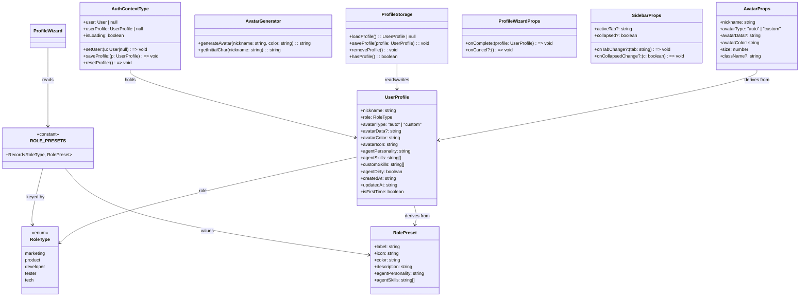
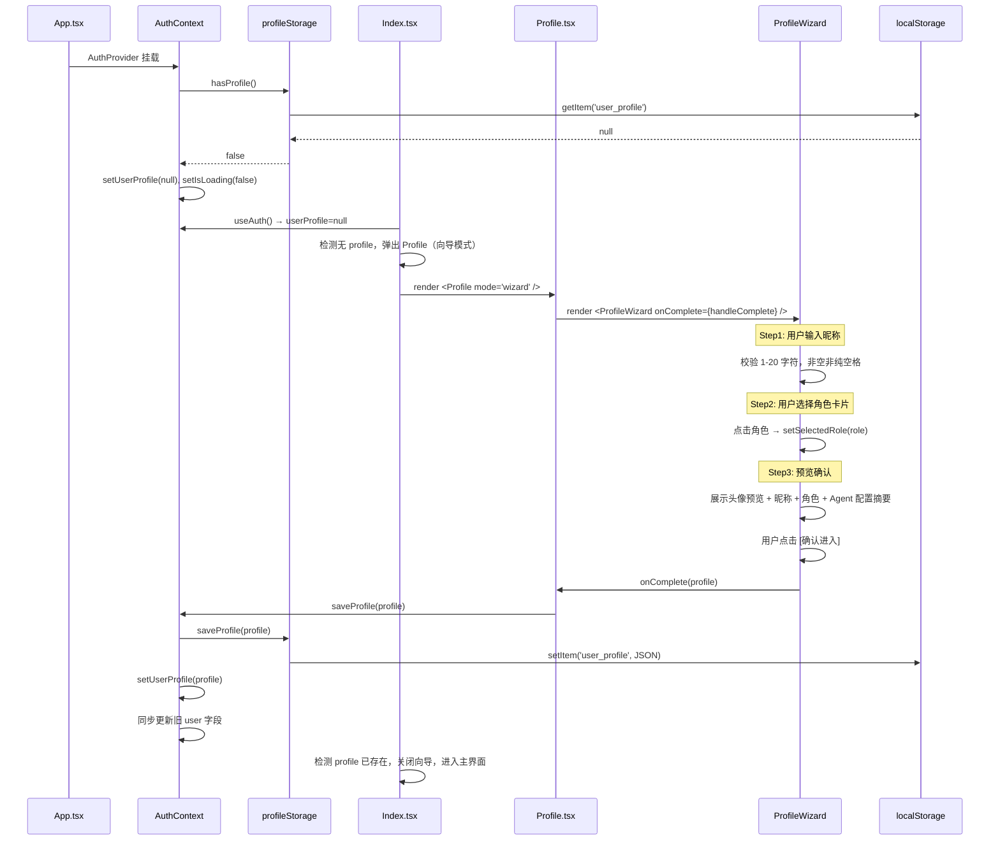
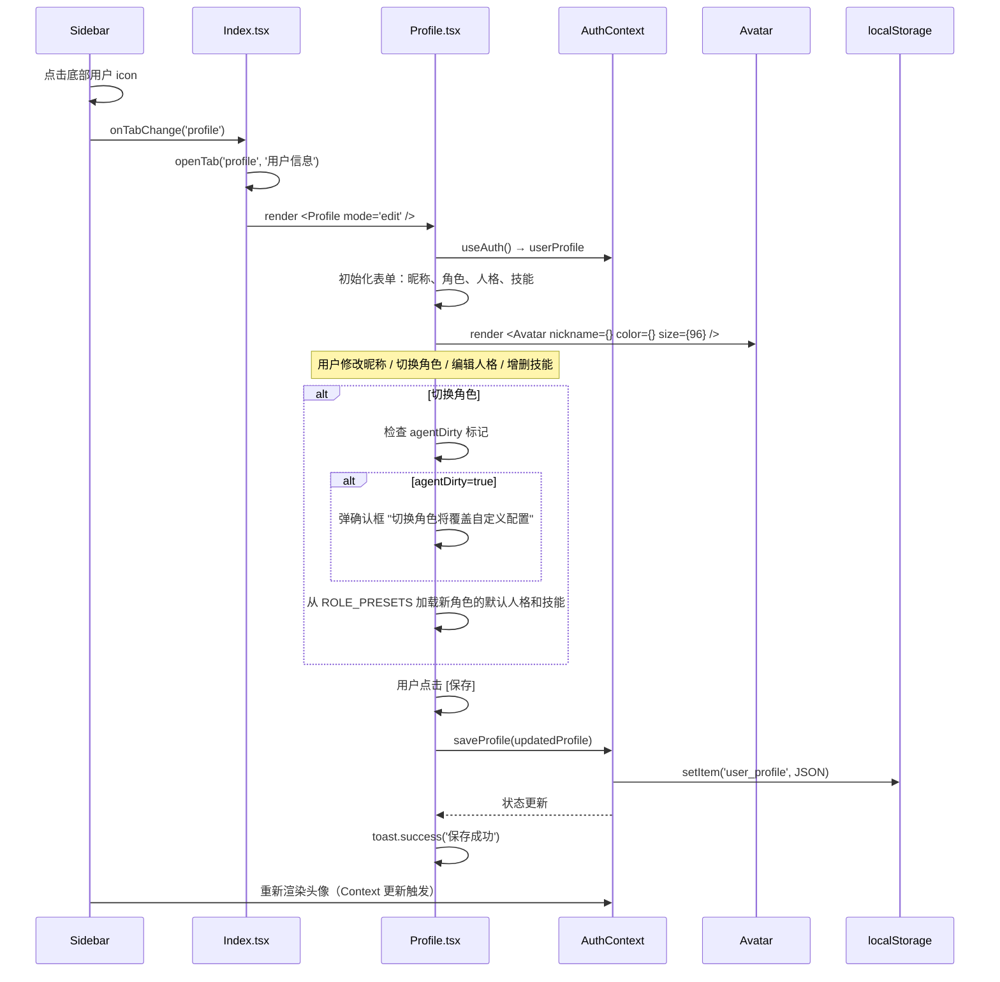
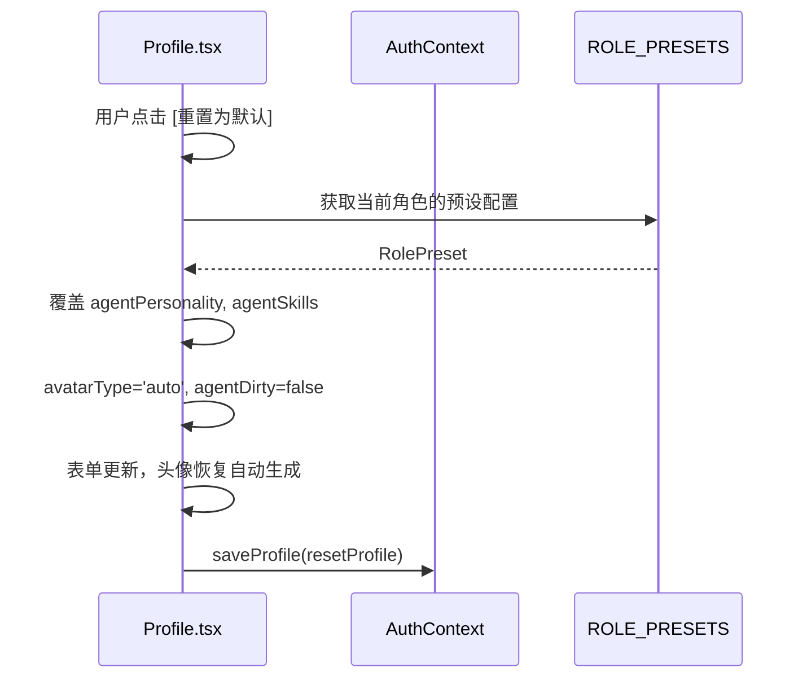
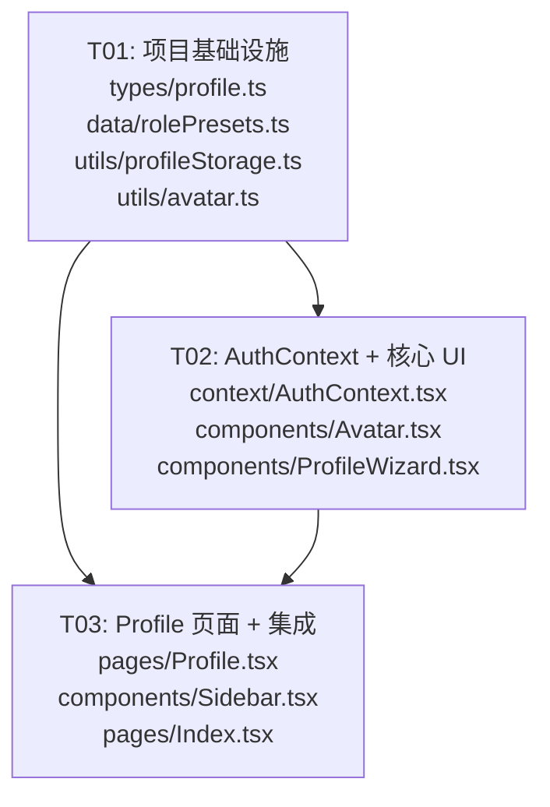

# 用户信息与 Agent 配置系统 — 架构设计

> **设计者**：Bob（架构师）
> **日期**：2025-07-11
> **技术栈**：Electron + React 19 + TypeScript + Vite + Tailwind CSS 4 + localStorage

---

## Part A: 系统设计

### 1. 实现方案

#### 核心难点分析

| 难点 | 方案 |
|------|------|
| **首次启动检测** | 读取 `localStorage` 键 `user_profile`，不存在或 `isFirstTime=true` 则弹出向导 |
| **向导与编辑模式切换** | Profile 页面通过 `useState` 内部状态 `mode: 'wizard' | 'edit'` 控制，无路由 |
| **头像自动生成** | 纯前端 Canvas/SVG 生成圆形头像：角色色底 + 昵称首字白色居中，输出 SVG data URL |
| **角色切换脏标记** | `agentDirty: boolean` 标记用户是否手动编辑过人格/技能；切换角色时若 dirty=true 弹确认框 |
| **与 AuthContext 兼容** | AuthContext 新增 `userProfile` 状态 + `saveProfile()` 方法，同时写入 `user_profile` 和旧 `user` 键 |
| **侧边栏集成** | Sidebar 接收 `userProfile` 渲染头像，点击触发 `onTabChange('profile')` |

#### 技术选型

| 层 | 选型 | 理由 |
|----|------|------|
| 状态管理 | React Context（AuthContext 扩展） | 已有 AuthContext，无需引入新状态库 |
| 数据持久化 | `localStorage` | 单用户桌面应用，PRD 明确要求 |
| 头像生成 | SVG `foreignObject` / Canvas 2D | 纯前端，零依赖，支持中文首字 & emoji |
| UI 组件 | Tailwind CSS 4 + lucide-react | 项目已有，保持一致 |
| 图标 | lucide-react（已在依赖中） | 角色图标映射到 lucide 图标名 |

#### 架构模式

采用 **Context + Container/Presentational** 模式：
- `AuthContext` 作为数据中心，持有 `UserProfile`
- `Profile` 页面为容器组件，负责状态管理和业务逻辑
- `ProfileWizard`、`Avatar` 为展示组件，纯 UI 渲染

---

### 2. 文件列表

```
src/
├── types/
│   └── profile.ts                  # [新建] UserProfile、RoleType、RolePreset 类型定义
├── data/
│   └── rolePresets.ts              # [新建] 5 种角色预设配置常量
├── utils/
│   ├── avatar.ts                   # [新建] 头像生成工具函数
│   └── profileStorage.ts           # [新建] localStorage 读写封装
├── context/
│   └── AuthContext.tsx              # [修改] 扩展 UserProfile 支持
├── components/
│   ├── Avatar.tsx                  # [新建] 可复用头像组件（自动生成 / 自定义上传）
│   ├── ProfileWizard.tsx           # [新建] 3 步向导组件（Step1 昵称 / Step2 选角色 / Step3 确认）
│   └── Sidebar.tsx                 # [修改] 用户 icon 区域改为可点击，渲染真实头像
└── pages/
    ├── Profile.tsx                 # [新建] 用户信息页（向导模式 + 编辑模式）
    └── Index.tsx                   # [修改] 注册 profile 标签页类型，添加路由分发
```

**总计**：新建 7 个文件，修改 3 个文件。

---

### 3. 数据结构和接口



---

### 4. 程序调用流

#### 4.1 首次启动向导流程



#### 4.2 侧边栏 → 用户信息页（编辑模式）



#### 4.3 重置为默认流程



---

### 5. 待澄清项

| # | 问题 | 假设 |
|---|------|------|
| Q1 | 向导是否应为全屏模态还是嵌入主窗口？ | **假设**：全屏居中模态框（覆盖在 Index 上方），首次启动时 Index 检测无 profile 即渲染向导 |
| Q2 | 自定义头像上传后的存储格式？ | **假设**：读取文件 → Canvas 缩放到 200×200 → `toDataURL('image/jpeg', 0.85)` → 存为 base64 data URL |
| Q3 | 昵称首字：中文"张三"取"张"，英文"Alice"取"A"，emoji "😀👍"取"😀"？ | **假设**：使用 `[...nickname][0]` 取第一个 Unicode 完整字符，覆盖中文/英文/emoji |
| Q4 | `agentDirty` 标记何时重置？ | **假设**：仅在"重置为默认"操作时重置为 false；切换角色时若用户确认覆盖也重置为 false |
| Q5 | 现有 AuthContext 的 `user` 键（`localStorage('user')`）是否需要迁移？ | **假设**：保留兼容。`saveProfile` 同时写入 `user_profile` 和 `user` 两个键，旧代码不受影响 |

---

## Part B: 任务分解

### 6. 所需依赖包

本项目无需新增第三方依赖，所有功能使用已有依赖实现：

```
- react@^19.2.0          # UI 框架（已安装）
- react-dom@^19.2.0      # React DOM（已安装）
- lucide-react@^0.555.0  # 图标库，角色图标映射（已安装）
- sonner@^2.0.7          # Toast 通知（已安装）
```

### 7. 任务列表（按依赖顺序）

---

#### T01：项目基础设施 — 类型定义 + 角色数据 + 工具函数

- **Task ID**：T01
- **优先级**：P0
- **依赖**：无

**源文件**：

| 文件 | 操作 | 说明 |
|------|------|------|
| `src/types/profile.ts` | 新建 | `UserProfile`、`RoleType`、`RolePreset` 类型定义 |
| `src/data/rolePresets.ts` | 新建 | `ROLE_PRESETS` 常量，5 种角色的完整预设配置 |
| `src/utils/profileStorage.ts` | 新建 | `loadProfile()` / `saveProfile()` / `hasProfile()` / `removeProfile()` |
| `src/utils/avatar.ts` | 新建 | `generateAvatarSVG(nickname, color, size)` / `getInitialChar(nickname)` |

**产出物说明**：
- `profile.ts`：导出 `UserProfile` 接口、`RoleType` 类型、`RolePreset` 接口
- `rolePresets.ts`：导出 `ROLE_PRESETS: Record<RoleType, RolePreset>`，key 为角色枚举值，value 包含 label/icon/color/description/agentPersonality/agentSkills
- `profileStorage.ts`：封装所有 `localStorage` 操作，单例模式，统一 key 为 `'user_profile'`
- `avatar.ts`：`generateAvatarSVG(nickname, color, size)` 返回 `<svg>...</svg>` 字符串作为 data URL；`getInitialChar` 取昵称首字符

---

#### T02：AuthContext 扩展 + 核心 UI 组件

- **Task ID**：T02
- **优先级**：P0
- **依赖**：T01

**源文件**：

| 文件 | 操作 | 说明 |
|------|------|------|
| `src/context/AuthContext.tsx` | 修改 | 新增 `userProfile` 状态 + `saveProfile()` / `resetProfile()` 方法；同步旧 `user` 键 |
| `src/components/Avatar.tsx` | 新建 | 可复用头像组件：自动生成模式渲染 SVG，自定义模式渲染 `` |
| `src/components/ProfileWizard.tsx` | 新建 | 3 步向导：Step1 昵称输入 → Step2 角色选择 → Step3 预览确认 |

**产出物说明**：
- **AuthContext.tsx** 修改：在现有 `AuthProvider` 中新增：
  - `userProfile` state（从 `localStorage('user_profile')` 初始化）
  - `saveProfile(profile: UserProfile)`：写入 localStorage + 更新 state + 同步旧 `user`
  - `resetProfile()`：调用 `removeProfile()` + 清空 state
  - 向后兼容：旧 `user` 读取逻辑保持不变（无 `user_profile` 时回退读 `user`）
- **Avatar.tsx**：Props 为 `{ nickname, avatarType, avatarData, avatarColor, size, className }`。`avatarType='auto'` 时调用 `generateAvatarSVG()`，`='custom'` 时渲染 ``。圆形裁切用 `rounded-full overflow-hidden`。
- **ProfileWizard.tsx**：内部状态管理 3 个 step（`currentStep: 1|2|3` + `nickname` + `selectedRole`）。每步有前进/后退按钮，Step3 调用 `onComplete(profile)`。

---

#### T03：Profile 页面 + 系统集成

- **Task ID**：T03
- **优先级**：P0
- **依赖**：T01, T02

**源文件**：

| 文件 | 操作 | 说明 |
|------|------|------|
| `src/pages/Profile.tsx` | 新建 | 用户信息页：向导模式（嵌入 ProfileWizard）+ 编辑模式（表单） |
| `src/components/Sidebar.tsx` | 修改 | 用户 icon 区域改为可点击，读取 userProfile 渲染真实头像 |
| `src/pages/Index.tsx` | 修改 | 注册 `profile` 标签页类型，添加 MENU_MAP 条目，渲染 Profile 组件 |

**产出物说明**：
- **Profile.tsx**：
  - 接收 props：无（通过 `useAuth()` 获取 context）
  - 内部判断 `mode`：若 `userProfile === null || userProfile.isFirstTime` → wizard 模式；否则 → edit 模式
  - **Wizard 模式**：渲染 `<ProfileWizard onComplete={handleWizardComplete} />`
  - **Edit 模式**：渲染完整表单（头像区 + 昵称输入 + 角色下拉 + 人格 textarea + 技能标签编辑器 + 保存/重置按钮）
  - 角色切换逻辑：检查 `agentDirty` → 弹确认 → 加载新预设
  - 头像上传（P1）：`<input type="file" accept="image/*">` → Canvas 缩放到 200×200 → base64
  - 技能增删：`customSkills` 的添加/删除操作
- **Sidebar.tsx** 修改：
  - 从 `useAuth()` 获取 `userProfile`
  - 底部用户区域：若有 profile → 渲染 `<Avatar>`；若无 → 保留当前默认 SVG
  - 添加 `onClick` → `onTabChange('profile')`
  - Hover tooltip 显示昵称
- **Index.tsx** 修改：
  - `MENU_MAP` 新增 `profile: { type: 'profile', title: '用户信息' }`
  - `page` switch 新增 `case 'profile': return <Lazy><Profile /></Lazy>;`
  - 首次启动检测：在 `useEffect` 中检查 `userProfile === null && !isLoading` → `openTab('profile', '用户信息')`
  - Sidebar activeTab 映射：新增 profile 分支

---

### 8. 共享知识

以下约定由所有任务共同遵循：

```
- 所有 localStorage 操作统一通过 profileStorage.ts 工具函数，不直接操作 localStorage
- 头像生成使用 SVG data URL 格式（data:image/svg+xml;utf8,...），不依赖 Canvas API
- 昵称首字符提取：const initial = [...nickname.trim()][0] || '?'
- 角色图标名使用 lucide-react 图标组件的 import 名称（如 TrendingUp, ClipboardList, Code2, FlaskConical, Cog）
- 所有日期字段使用 ISO 8601 UTC 格式：new Date().toISOString()
- Toast 通知使用 sonner 的 toast.success() / toast.error()
- AuthContext 的 user 兼容层：toLegacyUser(profile) 返回 { id:1, phone:'', nickname, avatar, role }
- Profile 编辑模式下，昵称修改后若 avatarType='auto'，头像实时更新
- agentDirty 标记：仅在用户手动编辑 agentPersonality 或 agentSkills 时设为 true
```

### 9. 任务依赖图



**实现顺序**：T01 → T02 → T03（线性依赖，每步完成后下一步可立即开始）

---

## 附录：关键接口速查

### A. localStorage 键约定

| 键名 | 类型 | 说明 |
|------|------|------|
| `user_profile` | `UserProfile` (JSON) | 主用户配置 |
| `user` | `User` (JSON) | 旧兼容键，由 `saveProfile` 同步写入 |

### B. UserProfile 完整类型

```typescript
// src/types/profile.ts
export type RoleType = 'marketing' | 'product' | 'developer' | 'tester' | 'tech';

export interface RolePreset {
  label: string;           // 中文标签："市场"、"产品" 等
  icon: string;            // lucide-react 图标组件名
  color: string;           // hex 主题色
  description: string;     // 一句话描述
  agentPersonality: string;// Agent 人格 Prompt
  agentSkills: string[];   // 默认技能列表
}

export interface UserProfile {
  nickname: string;
  role: RoleType;
  avatarType: 'auto' | 'custom';
  avatarData?: string;
  avatarColor: string;
  avatarIcon: string;
  agentPersonality: string;
  agentSkills: string[];
  customSkills: string[];
  agentDirty: boolean;
  createdAt: string;
  updatedAt: string;
  isFirstTime: boolean;
}
```

### C. Avatar 组件签名

```typescript
// src/components/Avatar.tsx
interface AvatarProps {
  nickname: string;
  avatarType: 'auto' | 'custom';
  avatarData?: string;
  avatarColor: string;
  size?: number;     // default: 40
  className?: string;
}
```

### D. ProfileWizard 组件签名

```typescript
// src/components/ProfileWizard.tsx
interface ProfileWizardProps {
  onComplete: (profile: UserProfile) => void;
  onCancel?: () => void;
}
```
