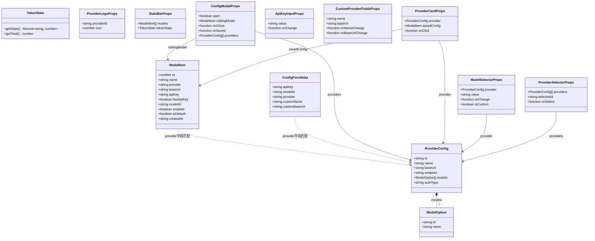
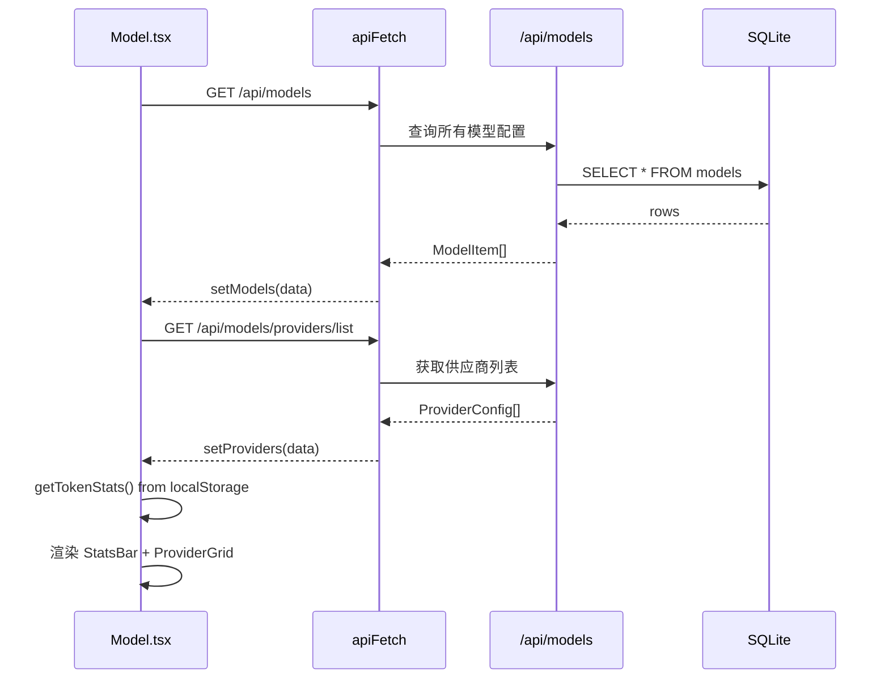
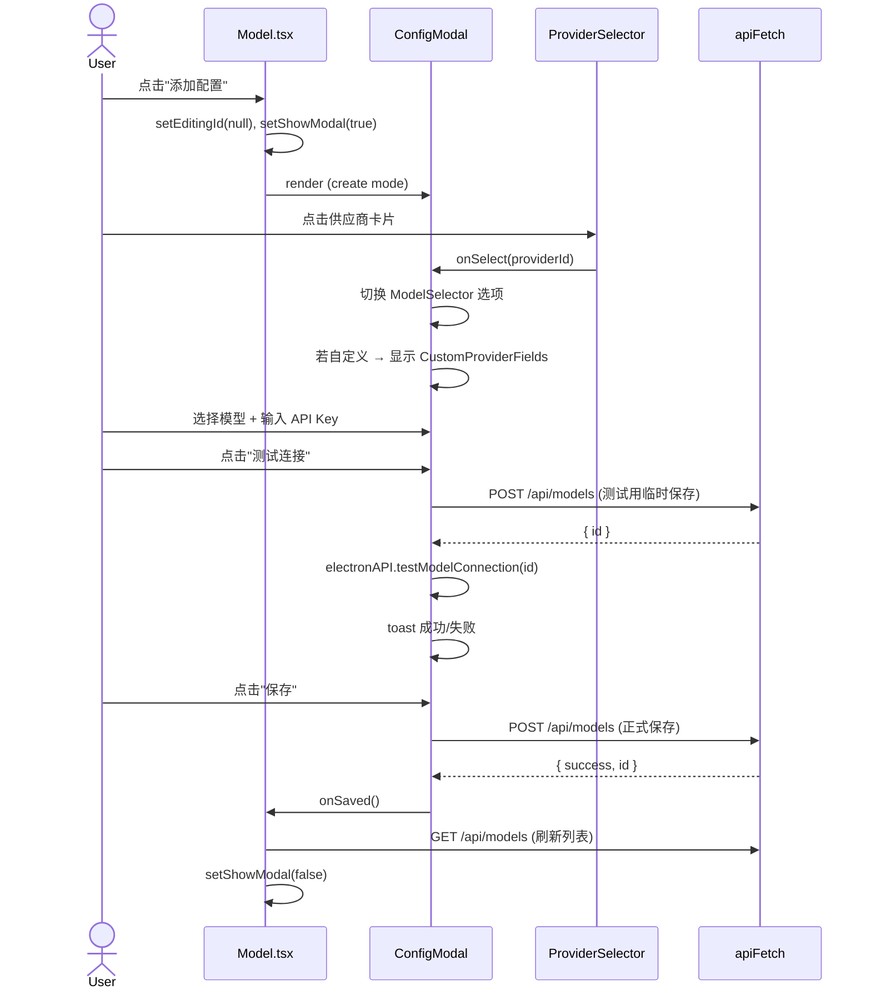
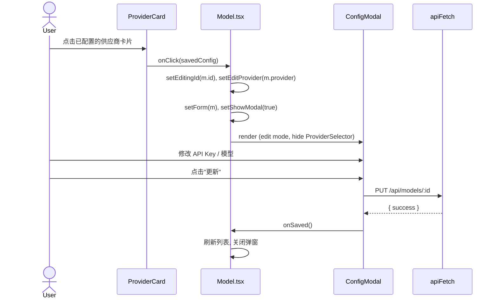
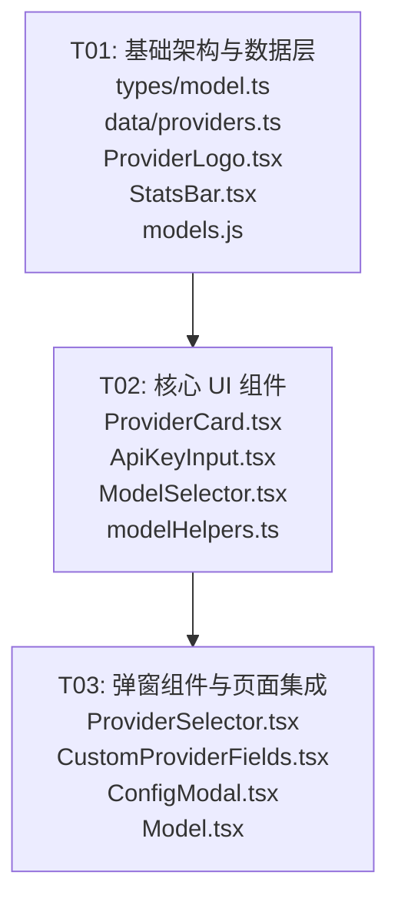

# 模型配置页面重设计 — 系统设计文档

> **作者**: Bob (Architect)  
> **日期**: 2025-07-04  
> **状态**: 待评审

---

## Part A: 系统设计

### 1. 实现方案

#### 1.1 核心技术挑战

| 挑战 | 分析 | 方案 |
|------|------|------|
| 单文件 225 行巨石组件 | 所有逻辑耦合在一个 `Model.tsx`，难以维护 | 拆分为页面编排层 + 6 个功能组件 |
| Provider 数据前后端重复 | `PROVIDER_LIST` 在前端，`PROVIDERS` 在后端各自维护 | 后端作为单一数据源，前端通过 `/api/models/providers/list` 获取 |
| 模型 ID 过时 | 当前使用 `deepseek-chat`、`glm-4.5` 等旧 ID | PRD 提供的最新 ID 统一更新到 `data/providers.ts` 和后端 |
| Logo 为文字 Monogram | 当前用首字母/汉字代替 Logo，辨识度低 | 每个供应商独立 SVG 图标组件，几何抽象风格，体现品牌特征 |
| 弹窗与页面耦合 | Modal 内联在页面 JSX 中，逻辑分散 | `ConfigModal` 独立组件，通过 Props 回调解耦 |

#### 1.2 架构模式

采用 **Container/Presenter 模式**（轻量级）：

- `Model.tsx`（Container）：状态管理、API 调用、业务逻辑编排
- 子组件（Presenter）：纯展示 + 局部交互，通过 Props 接收数据和回调

```
Model.tsx (Container)
  ├── StatsBar           ← 纯展示
  ├── ProviderCard[]     ← 展示 + 点击事件
  │   └── ProviderLogo   ← 纯 SVG 展示
  └── ConfigModal         ← 表单交互 + API 调用回调
      ├── ProviderSelector    ← 网格选择
      │   └── ProviderLogo    ← 纯 SVG 展示
      ├── CustomProviderFields ← 输入表单
      ├── ModelSelector       ← 下拉选择
      └── ApiKeyInput         ← 密码输入 + 切换
```

#### 1.3 框架与库选型

| 类别 | 选择 | 理由 |
|------|------|------|
| UI 框架 | React 18 + TypeScript | 项目现有技术栈 |
| 样式 | Tailwind CSS + CSS 变量 | 项目现有方案，`var(--wiki-*)` 主题变量 |
| 图标库 | lucide-react | 项目已使用，用于 Globe/Key/Eye 等功能图标 |
| 供应商 Logo | 内联 SVG 组件 | 零外部依赖，每个供应商独立 `export function` |
| 状态管理 | React `useState` / `useEffect` | 页面级状态无需全局 Store |
| Toast | sonner | 项目已使用 |

### 2. 文件清单

```
src/
├── types/
│   └── model.ts                          # [新建] 类型定义
├── data/
│   └── providers.ts                      # [新建] 供应商配置（最新模型ID）
├── utils/
│   └── modelHelpers.ts                   # [新建] 工具函数
├── components/
│   ├── ProviderLogo.tsx                  # [新建] 10 供应商 + 自定义 SVG Logo
│   ├── StatsBar.tsx                      # [新建] 4 卡片用量统计
│   ├── ProviderCard.tsx                  # [新建] 供应商卡片
│   ├── ApiKeyInput.tsx                   # [新建] API Key 输入框（含显示/隐藏）
│   ├── ModelSelector.tsx                 # [新建] 模型下拉选择器
│   ├── ProviderSelector.tsx              # [新建] 供应商网格选择器（弹窗内）
│   ├── CustomProviderFields.tsx          # [新建] 自定义供应商名称+地址输入
│   └── ConfigModal.tsx                   # [新建] 配置弹窗（双模式）
├── pages/
│   └── Model.tsx                         # [重写] 页面编排层
backend/src/routes/
│   └── models.js                         # [修改] 更新 Provider 配置和模型 ID
```

**文件统计**: 新建 10 个，修改 1 个，重写 1 个，共 12 个文件。

### 3. 数据结构与接口



### 4. 程序调用流程

#### 4.1 页面初始化



#### 4.2 新增配置（完整流程）



#### 4.3 编辑已有配置



### 5. 不确定事项

| # | 事项 | 假设 |
|---|------|------|
| 1 | "测试连接" 在新增模式下，是否先临时保存再测试？ | 是，沿用当前逻辑：先 POST 创建记录，得到 ID 后通过 `electronAPI.testModelConnection(id)` 测试 |
| 2 | Provider 数据源 | 前端使用 `data/providers.ts` 作为主要展示数据，后端 `/api/models/providers/list` 作为运行时 API 来源 |
| 3 | 自定义供应商的 provider ID 格式 | 沿用当前 `custom-{timestamp}` 格式 |
| 4 | API Key 加密 | 后端已通过 Electron `safeStorage` 加密存储，前端不做额外处理 |
| 5 | 供应商 Logo 风格 | 几何抽象 SVG，不使用外部图片 URL，每个供应商独立导出函数 |

---

## Part B: 任务分解

### 6. 所需依赖包

```
- react@^18.3.1: UI 框架（已有）
- lucide-react: 功能图标库（已有）
- sonner: Toast 通知（已有）
- typescript: 类型检查（已有）
- tailwindcss: 样式框架（已有）
```

无新增第三方依赖。

### 7. 任务列表

#### T01: 基础架构与数据层

| 属性 | 值 |
|------|-----|
| **Task ID** | T01 |
| **任务名** | 基础架构与数据层 |
| **源文件** | `src/types/model.ts`（新建）<br>`src/data/providers.ts`（新建）<br>`src/components/ProviderLogo.tsx`（新建）<br>`src/components/StatsBar.tsx`（新建）<br>`backend/src/routes/models.js`（修改） |
| **依赖** | 无 |
| **优先级** | P0 |

**工作内容**：

1. **`src/types/model.ts`** — 定义所有 TypeScript 接口：
   - `ModelItem`：数据库模型配置记录
   - `ProviderConfig`：供应商配置（含模型列表）
   - `ModelOption`：单个模型选项
   - `ConfigFormData`：弹窗表单数据
   - 各组件 Props 接口

2. **`src/data/providers.ts`** — 供应商配置常量，使用 **PRD 最新模型 ID**：
   - 10 个内置供应商完整配置
   - `getProviderById(id)` 查找函数
   - `isCustomProvider(id)` 判断函数
   - `getProviderName(id)` 获取显示名称

3. **`src/components/ProviderLogo.tsx`** — 供应商 SVG Logo 组件：
   - 每个供应商独立 `export function XxxLogo({size})` 
   - 统一入口 `<ProviderLogo providerId={id} size={44} />`
   - 自定义供应商使用 Globe 图标
   - 所有 SVG 内联，零外部依赖

4. **`src/components/StatsBar.tsx`** — 4 卡片用量统计：
   - 已配置 / 已启用 / Token 用量 / 默认模型
   - Props: `models: ModelItem[]`, `tokenStats: Record<string, number>`
   - 纯展示组件，无副作用

5. **`backend/src/routes/models.js`** — 更新 Provider 配置：
   - 更新所有供应商模型 ID 为 PRD 最新版本
   - DeepSeek: `deepseek-v4-pro`, `deepseek-v4-flash`
   - MiniMax: `MiniMax-M3`, `MiniMax-M2.7`
   - Mimo: `mimo-v2.5-pro`, `mimo-v2.5-flash`
   - 智谱: `glm-5`, `glm-5-flash`
   - Moonshot: `kimi-k2.6`, `kimi-k2.5`, `moonshot-v1-8k`
   - 阿里云百炼: `qwen3.7-max`, `qwen3.7-plus`
   - 火山引擎: `doubao-seed-2.0-32k`, `doubao-seed-2.0-lite`
   - 腾讯混元: `hunyuan-turbos-latest`, `hunyuan-lite`
   - 百度千帆: `ernie-5.1`, `ernie-5.0`
   - 硅基流动: `deepseek-ai/DeepSeek-V3`, `Qwen/Qwen3-235B-A22B`

---

#### T02: 核心 UI 组件

| 属性 | 值 |
|------|-----|
| **Task ID** | T02 |
| **任务名** | 核心 UI 组件 |
| **源文件** | `src/components/ProviderCard.tsx`（新建）<br>`src/components/ApiKeyInput.tsx`（新建）<br>`src/components/ModelSelector.tsx`（新建）<br>`src/utils/modelHelpers.ts`（新建） |
| **依赖** | T01 |
| **优先级** | P0 |

**工作内容**：

1. **`src/components/ProviderCard.tsx`** — 供应商卡片：
   - 2 列 Grid 中的单个卡片
   - 左侧 `ProviderLogo` + 右侧信息区
   - 信息区：供应商名称 + 状态指示器（绿点/灰点）+ 默认星标 + 已配置模型名
   - 未配置时显示"点击配置"引导文字
   - Props: `provider: ProviderConfig`, `savedConfig?: ModelItem`, `onClick: () => void`
   - 样式：圆角卡片 + wiki 主题变量 + hover 效果

2. **`src/components/ApiKeyInput.tsx`** — API Key 输入框：
   - `type` 在 `password` / `text` 之间切换
   - 右侧 Eye/EyeOff 图标按钮
   - Props: `value: string`, `onChange: (v: string) => void`
   - 样式与现有表单统一

3. **`src/components/ModelSelector.tsx`** — 模型下拉选择器：
   - 内置供应商：`<select>` 下拉，显示 `模型名称 (模型ID)`
   - 自定义供应商：`<input>` 自由输入
   - Props: `provider: ProviderConfig | null`, `value: string`, `onChange: (v: string) => void`, `isCustom: boolean`

4. **`src/utils/modelHelpers.ts`** — 工具函数：
   - `generateModelName(provider, modelId)` — 生成显示名称
   - `getEnabledCount(models)` — 已启用数量
   - `getDefaultModelName(models)` — 默认模型简称
   - `formatTokenCount(n)` — Token 数量格式化（K/M）

---

#### T03: 弹窗组件与页面集成

| 属性 | 值 |
|------|-----|
| **Task ID** | T03 |
| **任务名** | 弹窗组件与页面集成 |
| **源文件** | `src/components/ProviderSelector.tsx`（新建）<br>`src/components/CustomProviderFields.tsx`（新建）<br>`src/components/ConfigModal.tsx`（新建）<br>`src/pages/Model.tsx`（重写） |
| **依赖** | T01, T02 |
| **优先级** | P0 |

**工作内容**：

1. **`src/components/ProviderSelector.tsx`** — 供应商网格选择器：
   - 3 列 Grid 布局
   - 每个选项：`ProviderLogo`（32px）+ 名称
   - 选中态：高亮边框（`var(--wiki-warning)`）
   - 最后一项为"自定义"选项（Globe 图标）
   - Props: `providers: ProviderConfig[]`, `selectedId: string`, `onSelect: (id: string) => void`

2. **`src/components/CustomProviderFields.tsx`** — 自定义供应商表单：
   - 供应商名称输入框
   - API 地址输入框（placeholder: `https://...`）
   - 双列并排布局
   - Props: `name`, `baseUrl`, `onNameChange`, `onBaseUrlChange`

3. **`src/components/ConfigModal.tsx`** — 配置弹窗（核心组件）：
   - **双模式**：
     - 新增模式：显示 ProviderSelector → 选择后显示对应表单
     - 编辑模式：隐藏 ProviderSelector，直接显示当前配置表单
   - **表单区域**：
     - 自定义供应商时显示 CustomProviderFields
     - ModelSelector（内置供应商）或文本输入（自定义）
     - ApiKeyInput
   - **操作按钮**：
     - "测试连接" — 调用测试逻辑
     - "保存/更新" — 提交表单
     - "删除"（仅编辑模式）
   - **状态管理**：
     - `form: ConfigFormData` 内部状态
     - `testing: boolean`, `saving: boolean` 加载态
   - Props: `open`, `editingModel`, `providers`, `onClose`, `onSaved`
   - 宽 480px，最大高度 85vh，可滚动

4. **`src/pages/Model.tsx`** — 页面编排层（重写）：
   - 页面布局：StatsBar + "添加配置" 按钮 + Provider 卡片网格 + 自定义供应商区
   - 状态管理：
     - `models: ModelItem[]` — 已保存配置列表
     - `providers: ProviderConfig[]` — 供应商列表（从 data/providers 导入）
     - `showModal`, `editingModel` — 弹窗控制
     - `tokenStats` — Token 用量统计
   - 核心操作函数：
     - `fetchModels()` — 获取配置列表
     - `openAdd(providerId?)` — 打开新增弹窗
     - `openEdit(model)` — 打开编辑弹窗
     - `handleSaved()` — 弹窗保存后刷新
     - `toggleModel(id)` — 启用/禁用
     - `setDefault(id)` — 设为默认
     - `deleteModel(id)` — 删除配置
   - 原有功能 100% 保留，代码从 ~225 行精简至 ~120 行（编排逻辑）

---

### 8. 共享知识

```
- 所有 API 响应格式: { success: boolean, error?: string, id?: number }
- API Key 存储: 后端通过 Electron safeStorage 加密，前端列表返回掩码 "******xxxx"
- 主题变量: 使用 var(--wiki-text), var(--wiki-bg), var(--wiki-surface), var(--wiki-border), var(--wiki-warning), var(--wiki-success), var(--wiki-danger), var(--wiki-text2), var(--wiki-text3), var(--wiki-surface2), var(--wiki-overlay-heavy), var(--wiki-danger-bg)
- Provider ID 约定: 内置供应商使用小写英文 id（deepseek, minimax, ...），自定义使用 "custom-{timestamp}"
- Token 统计: 存储在 localStorage key "model_token_usage"，格式 Record<modelName, number>
- 供应商 Logo: 全部内联 SVG，不依赖外部 URL/图片文件
- 弹窗宽度: 480px, 最大高度 85vh
- 卡片网格: 2 列 (grid-cols-2)，间距 gap-3
- 供应商选择器网格: 3 列 (grid-cols-3)，间距 gap-2
```

### 9. 任务依赖图



**实现顺序**: T01 → T02 → T03

---

## 附录 A: ProviderLogo 设计规范

每个供应商 Logo 组件遵循以下规范：

| 规则 | 说明 |
|------|------|
| 函数命名 | `export function XxxLogo({ size }: { size: number })` |
| 画布尺寸 | `viewBox="0 0 48 48"`，由 `size` prop 控制实际尺寸 |
| 背景形状 | 12px 圆角矩形 `<rect width="48" height="48" rx="12">` |
| 品牌色 | 每个供应商使用独特品牌色作为背景填充 |
| 前景元素 | 几何抽象图形（圆、路径、多边形）+ 白色填充 |
| 统一入口 | `<ProviderLogo providerId={id} size={44} />` 通过 Record 映射 |

**品牌色方案**：

| 供应商 | ID | 品牌色 | 设计元素 |
|--------|-----|--------|----------|
| DeepSeek | `deepseek` | `#4F46E5` | 互联节点网络（两圆+连线） |
| MiniMax | `minimax` | `#F59E0B` | 动态双三角叠加 |
| Mimo AI | `mimo` | 渐变 `#EC4899→#8B5CF6` | 双弧线交汇 |
| 智谱 AI | `zhipu` | `#6366F1` | 层叠六边形 |
| Moonshot | `moonshot` | `#10B981` | 新月+轨道环 |
| 阿里云百炼 | `dashscope` | `#06B6D4` | 云纹抽象形 |
| 火山引擎 | `volcengine` | `#6D28D9` | 火焰/羽翼造型 |
| 腾讯混元 | `tencent` | `#14B8A6` | 太极双鱼简化形 |
| 百度千帆 | `qianfan` | `#F43F5E` | 风帆/波浪造型 |
| 硅基流动 | `siliconflow` | `#EAB308` | 芯片电路纹样 |
| 自定义 | `custom` | `#6B7280` | Globe 图标 (lucide) |

**Logo 组件导出结构**:
```typescript
// 独立导出
export function DeepSeekLogo({ size }: { size: number }): JSX.Element;
export function MiniMaxLogo({ size }: { size: number }): JSX.Element;
// ... 共 10 个

// 统一入口
export default function ProviderLogo({ providerId, size }: ProviderLogoProps): JSX.Element;
```

## 附录 B: ConfigModal Props 完整接口

```typescript
interface ConfigModalProps {
  /** 是否显示弹窗 */
  open: boolean;
  /** 编辑模式下的已有模型配置（null = 新增模式） */
  editingModel: ModelItem | null;
  /** 所有供应商配置列表 */
  providers: ProviderConfig[];
  /** 关闭弹窗回调 */
  onClose: () => void;
  /** 保存成功回调（触发页面刷新） */
  onSaved: () => void;
}
```

**内部状态**:
```typescript
// 表单数据
form: {
  apiKey: string;
  modelId: string;
  provider: string;      // 供应商 ID
  customName: string;    // 自定义供应商名称
  customBaseUrl: string; // 自定义供应商 API 地址
}
// UI 状态
showKey: boolean;   // API Key 明文/密文
testing: boolean;   // 测试连接中
saving: boolean;    // 保存中
```

**模式判断逻辑**:
```
if (editingModel !== null) → 编辑模式
  - 隐藏 ProviderSelector
  - 直接显示 ModelSelector + ApiKeyInput
  - 显示"删除"按钮
  - 按钮文案："更新"
  
else → 新增模式
  - 显示 ProviderSelector（未选择时）
  - 选择后显示 ModelSelector + ApiKeyInput
  - 自定义供应商显示 CustomProviderFields
  - 按钮文案："添加"
```
