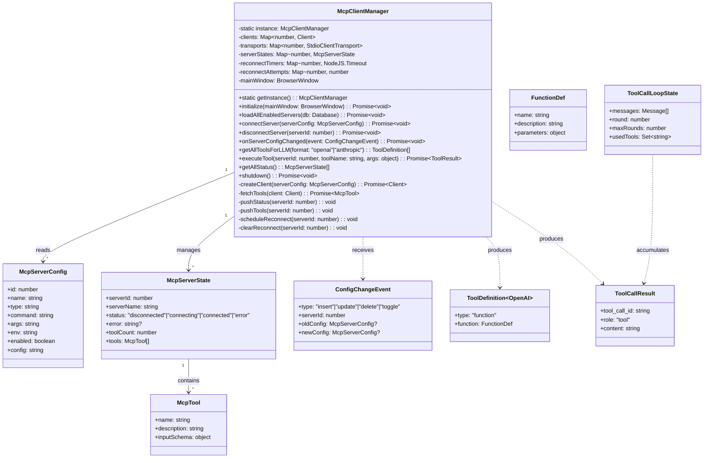
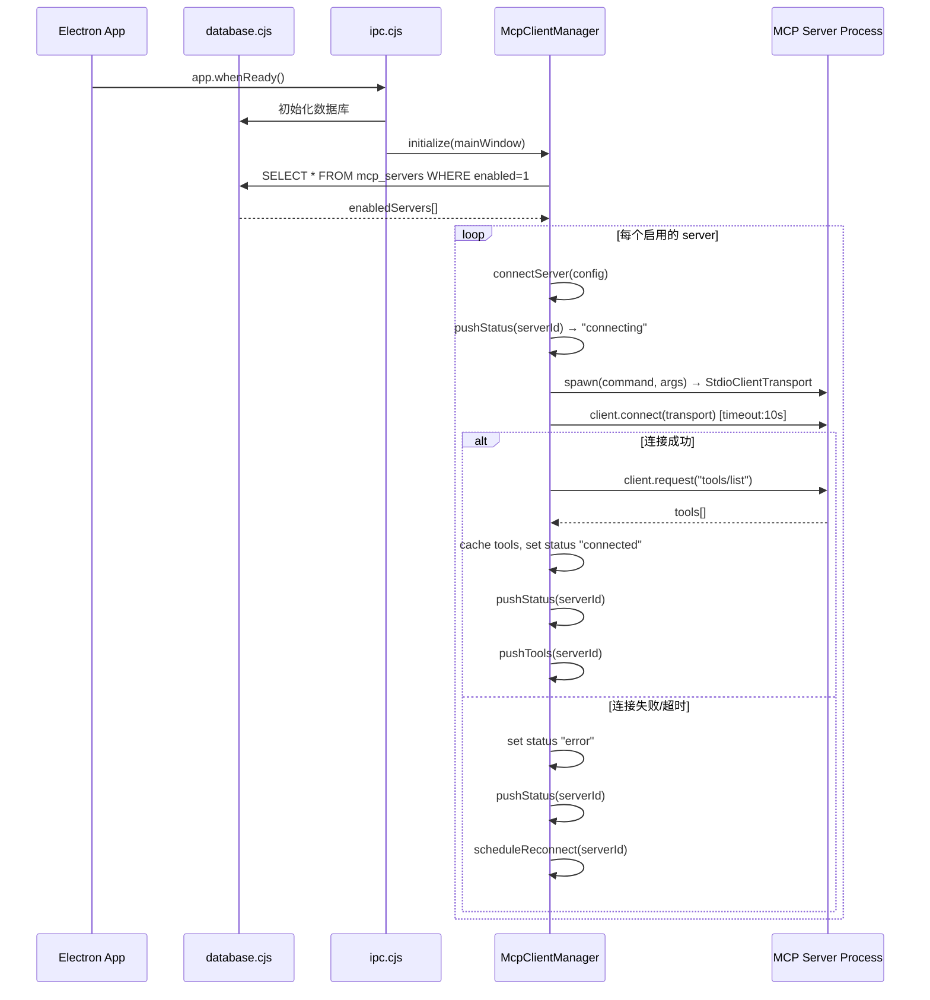
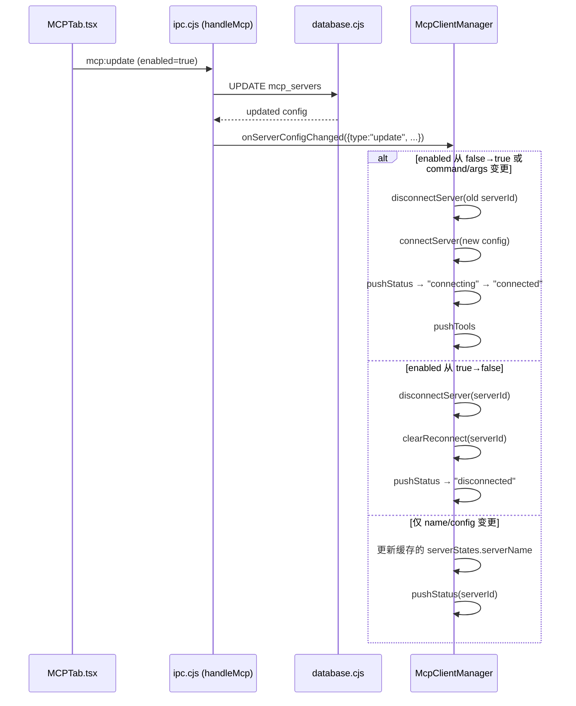
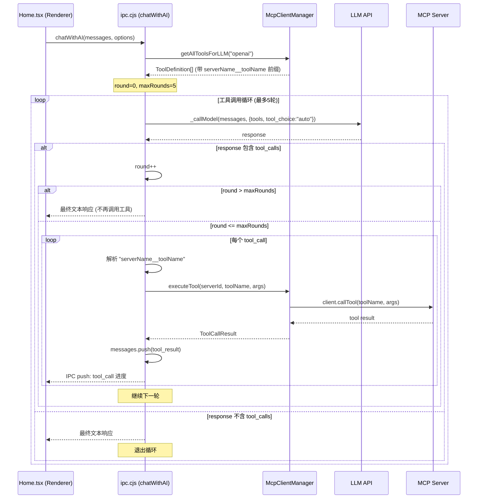
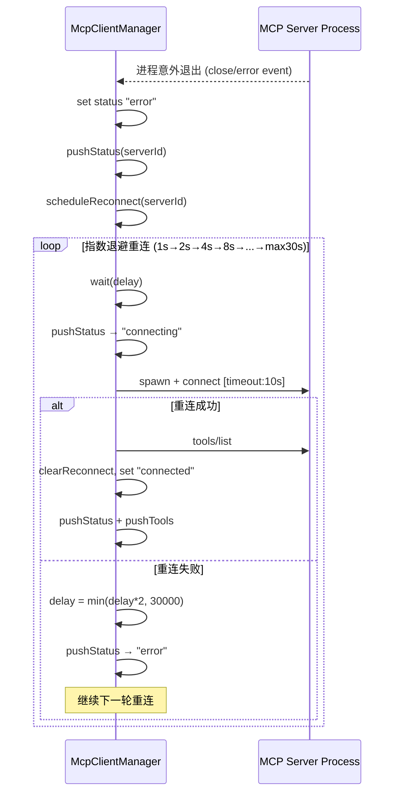
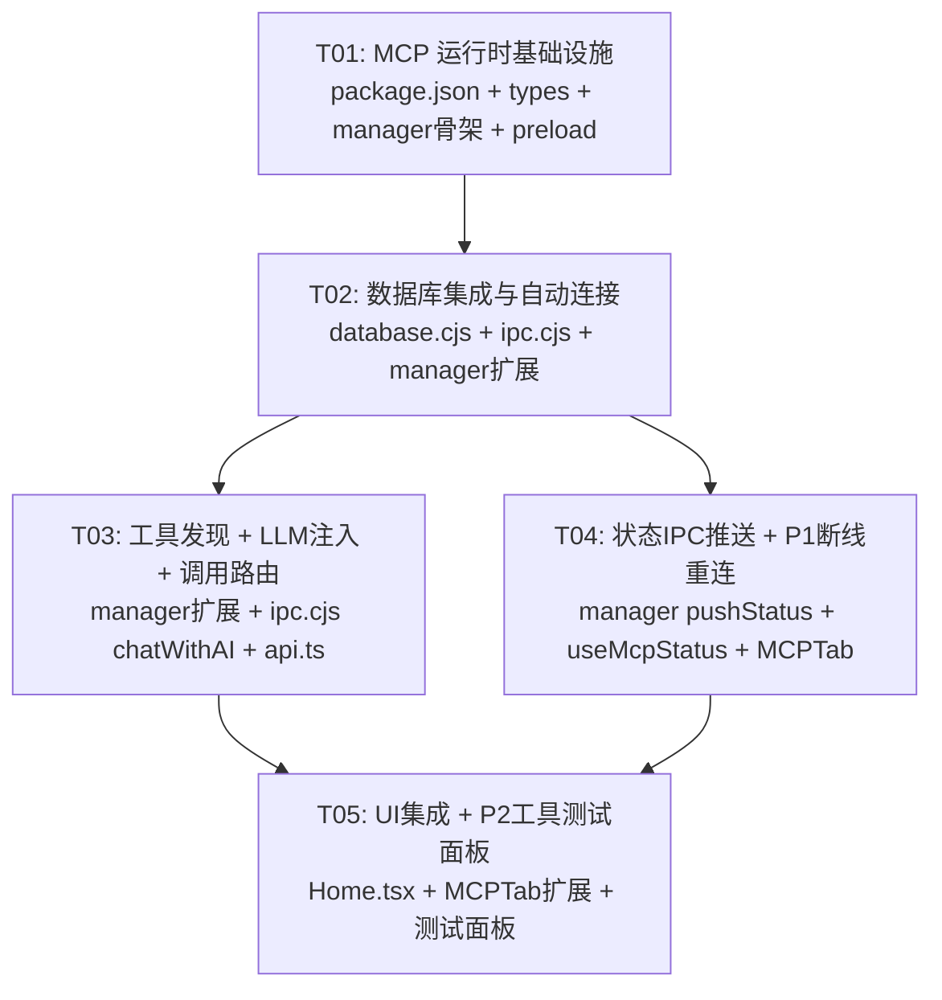

# Workit MCP 运行时集成 — 系统设计文档

## Part A: 系统设计

---

### 1. 实现方案

#### 核心技术挑战

| 挑战 | 分析 | 方案 |
|------|------|------|
| **ESM SDK 在 CJS 主进程中使用** | `@modelcontextprotocol/sdk` 是纯 ESM 包，现有 electron 代码均为 `.cjs` | 使用动态 `import()` 在 CJS 中加载 ESM SDK，封装在 `mcp-client-manager.cjs` 中 |
| **sql.js 内存数据库变更监听** | sql.js 无原生 trigger/event 机制 | 在 `handleMcp()` 的 CRUD 操作后显式调用 `McpClientManager.onServerConfigChanged()` |
| **工具名冲突** | 不同 MCP 服务可能提供同名工具 | 采用 `serverName__toolName` 前缀策略，在注入 LLM 时自动添加前缀 |
| **多轮工具调用循环** | LLM 可能连续要求调用多个工具 | 实现状态机循环，最大 5 轮，每轮可包含多个 tool_call |
| **IPC 实时推送** | Electron 主进程需主动推送状态到渲染进程 | 使用 `webContents.send()` 实现推模式，渲染进程通过 `ipcRenderer.on()` 监听 |

#### 框架选型

- **MCP SDK**：`@modelcontextprotocol/sdk@^1.x` — 官方 SDK，提供 `Client` + `StdioClientTransport`
- **无需额外框架**：现有 sql.js 数据库、Electron IPC、Vite 构建体系已足够

#### 架构模式

```
┌─────────────────────────────────────────────────────────┐
│                     Main Process                         │
│  ┌──────────────┐  ┌──────────────────────────────┐     │
│  │ database.cjs  │  │  mcp-client-manager.cjs       │     │
│  │ (sql.js)     │◄─┤  (Singleton)                  │     │
│  │ mcp_servers  │  │  ┌──────────┐ ┌───────────┐  │     │
│  │ CRUD hooks   │  │  │Client 1  │ │Client 2   │  │     │
│  └──────┬───────┘  │  │(stdio)   │ │(stdio)    │  │     │
│         │          │  └──────────┘ └───────────┘  │     │
│  ┌──────▼───────┐  │  toolCache, statusMap        │     │
│  │  ipc.cjs     │  └──────────────┬───────────────┘     │
│  │ chatWithAI() │◄────────────────┤                      │
│  │ handleMcp()  │                 │                      │
│  │ tool loop    │                 │ webContents.send()   │
│  └──────┬───────┘                 │                      │
│         │ IPC                      │                      │
└─────────┼─────────────────────────┼──────────────────────┘
          │                         │
┌─────────▼─────────────────────────▼──────────────────────┐
│                   Renderer Process                        │
│  ┌──────────┐  ┌───────────────┐  ┌──────────────────┐   │
│  │ Home.tsx  │  │  MCPTab.tsx   │  │ useMcpStatus.ts  │   │
│  │ (chat)   │  │  (status UI)  │  │ (hook)           │   │
│  └──────────┘  └───────────────┘  └──────────────────┘   │
└─────────────────────────────────────────────────────────┘
```

---

### 2. 文件列表

**新建文件：**

| 文件路径 | 用途 | 模块类型 |
|----------|------|----------|
| `electron/mcp-client-manager.cjs` | MCP 客户端管理器单例 | CJS (主进程) |
| `electron/mcp-types.cjs` | MCP 类型定义与常量 | CJS (主进程) |
| `src/hooks/useMcpStatus.ts` | MCP 状态订阅 React Hook | TS (渲染进程) |

**修改文件：**

| 文件路径 | 修改内容 |
|----------|----------|
| `package.json` | 添加 `@modelcontextprotocol/sdk` 依赖 |
| `electron/database.cjs` | 在 MCP CRUD 操作后添加变更通知钩子 |
| `electron/ipc.cjs` | 添加 MCP 运行时 IPC handler，修改 `chatWithAI`/`_callModel` |
| `electron/preload.cjs` | 暴露新的 MCP IPC API 到渲染进程 |
| `src/api.ts` | 添加 MCP 运行时相关类型定义 |
| `src/components/MCPTab.tsx` | 显示连接状态、工具数量、状态指示灯 |
| `src/pages/AppEcosystem.tsx` | 集成 MCP 状态上下文 |
| `src/pages/Home.tsx` | 工具调用状态提示（如"正在调用 MCP 工具..."） |

---

### 3. 数据结构与接口



---

### 4. 程序调用流程

#### 4.1 应用启动 → MCP 自动连接



#### 4.2 配置变更 → 自动重连



#### 4.3 LLM 工具注入与调用循环



#### 4.4 断线重连（P1）



---

### 5. 待明确事项

| # | 问题 | 当前假设 |
|---|------|----------|
| 1 | `@modelcontextprotocol/sdk` 的精确版本号 | 假设使用 `^1.0.0`，需验证最新稳定版 |
| 2 | 现有 `handleMcp()` 的完整签名与返回值格式 | 假设为标准 REST 风格 `{success, data}` 格式，需对接 |
| 3 | `_callModel` 目前支持的 LLM provider 有哪些 | 从 PRD 知支持 OpenAI 和 Anthropic 格式，Anthropic 的 tool_use 格式与 OpenAI tool_calls 不同，需分别适配 |
| 4 | Anthropic 格式的工具定义结构 | 假设使用 `{name, description, input_schema}` 格式（Anthropic 标准），与 OpenAI 的 `{type:"function", function:{...}}` 分开处理 |
| 5 | 渲染进程中 `window.electronAPI` 的现有结构 | 假设通过 contextBridge 暴露，新增 `mcp` 命名空间 |
| 6 | `mcp_servers` 表 `config` 字段的结构 | 假设为 JSON 字符串，存储额外配置（如 timeout、重连策略等） |
| 7 | 主进程文件是否可转换为 `.mjs` | 当前假设全部保持 `.cjs`，通过动态 `import()` 加载 ESM SDK |

---

## Part B: 任务分解

---

### 6. 依赖包

```
- @modelcontextprotocol/sdk@^1.0.0: MCP 官方 SDK (Client + StdioClientTransport)
```

> 无其他新依赖。现有 `sql.js`、Electron IPC、React 19 体系已满足需求。

---

### 7. 任务列表（按依赖排序）

#### T01：MCP 运行时基础设施

| 属性 | 值 |
|------|-----|
| **Task ID** | T01 |
| **任务名称** | MCP 运行时基础设施 |
| **源文件** | `package.json`、`electron/mcp-types.cjs`、`electron/mcp-client-manager.cjs`、`electron/preload.cjs` |
| **依赖** | 无 |
| **优先级** | P0 |

**工作内容：**

1. **`package.json`**：添加 `"@modelcontextprotocol/sdk": "^1.0.0"` 到 dependencies，执行 `npm install`
2. **`electron/mcp-types.cjs`**（新建）：
   - 定义 `McpServerConfig`、`McpServerState`、`McpTool`、`ConfigChangeEvent`、`ToolCallResult` 等核心类型
   - 定义常量：`MAX_TOOL_CALL_ROUNDS=5`、`CONNECT_TIMEOUT_MS=10000`、`RECONNECT_BASE_DELAY_MS=1000`、`RECONNECT_MAX_DELAY_MS=30000`
   - 导出 `formatToolName(serverName, toolName)` 和 `parseToolName(prefixedName)` 工具函数
3. **`electron/mcp-client-manager.cjs`**（新建）：
   - 实现 `McpClientManager` 单例类骨架
   - `getInstance()`、`initialize(mainWindow)`、`shutdown()`
   - `connectServer(config)`：通过动态 `import('@modelcontextprotocol/sdk/client/index.js')` 和 `import('@modelcontextprotocol/sdk/client/stdio.js')` 创建 Client + StdioClientTransport
   - `disconnectServer(serverId)`：关闭 transport 和 client
   - `pushStatus(serverId)` / `pushTools(serverId)`：通过 `mainWindow.webContents.send()` 推送
   - 连接超时逻辑（10s Promise.race）
4. **`electron/preload.cjs`**（修改）：
   - 通过 contextBridge 暴露 `window.electronAPI.mcp`，包含：
     - `onStatusUpdate(callback)` — 监听 `mcp:status-update`
     - `onToolsUpdated(callback)` — 监听 `mcp:tools-updated`
     - `getAllStatus()` — 调用 `mcp:get-all-status`
     - `getTools(serverId)` — 调用 `mcp:get-tools`

---

#### T02：数据库集成与自动连接/断开

| 属性 | 值 |
|------|-----|
| **Task ID** | T02 |
| **任务名称** | 数据库集成与自动连接/断开 |
| **源文件** | `electron/database.cjs`、`electron/ipc.cjs`、`electron/mcp-client-manager.cjs` |
| **依赖** | T01 |
| **优先级** | P0 |

**工作内容：**

1. **`electron/database.cjs`**（修改）：
   - 在 `handleMcp()` 的 insert/update/delete/toggle 操作成功后，调用 `McpClientManager.onServerConfigChanged(event)`
   - 需导出 `getAllEnabledMcpServers(db)` 辅助函数供 McpClientManager 使用
2. **`electron/ipc.cjs`**（修改）：
   - 在 `app.whenReady()` 后调用 `mcpClientManager.initialize(mainWindow)`
   - 在 `app.on('will-quit')` 中调用 `mcpClientManager.shutdown()`
   - 添加 IPC handler：
     - `mcp:get-all-status` → 返回 `mcpClientManager.getAllStatus()`
     - `mcp:get-tools` → 返回 `mcpClientManager.getToolsForServer(serverId)`
     - `mcp:test-tool` → 调用 `mcpClientManager.executeTool(serverId, toolName, args)`（P2 预留）
3. **`electron/mcp-client-manager.cjs`**（扩展）：
   - 实现 `onServerConfigChanged(event)`：
     - `insert` 且 enabled → connectServer
     - `update` enabled 变化 → connect/disconnect
     - `update` command/args 变化 → disconnect + reconnect
     - `delete` → disconnect + cleanup
   - 实现 `loadAllEnabledServers(db)`：从 DB 读取并连接所有启用的 server

---

#### T03：工具发现、LLM 工具注入与调用路由

| 属性 | 值 |
|------|-----|
| **Task ID** | T03 |
| **任务名称** | 工具发现、LLM 工具注入与调用路由 |
| **源文件** | `electron/mcp-client-manager.cjs`、`electron/ipc.cjs`、`src/api.ts` |
| **依赖** | T02 |
| **优先级** | P0 |

**工作内容：**

1. **`electron/mcp-client-manager.cjs`**（扩展）：
   - 实现 `fetchTools(client)`：调用 `client.request({method:'tools/list'})`，缓存结果
   - 实现 `getAllToolsForLLM(format)`：
     - `"openai"` 格式：`[{type:"function", function:{name:"serverName__toolName", description, parameters}}]`
     - `"anthropic"` 格式：`[{name:"serverName__toolName", description, input_schema}]`
   - 实现 `executeTool(serverId, toolName, args)`：
     - 去除 `serverName__` 前缀，用原始 toolName 调用 `client.callTool()`
     - 返回 `{tool_call_id, role:"tool", content: JSON.stringify(result)}`
   - 监听 `list_changed` 通知：`client.setNotificationHandler({method:'notifications/tools/list_changed'}, () => fetchTools(client))`
2. **`electron/ipc.cjs`**（修改）：
   - 修改 `chatWithAI` handler：
     - 获取 `mcpClientManager.getAllToolsForLLM(format)`，根据 LLM provider 选择格式
     - 注入 tools 到 `_callModel` 请求参数
     - 实现工具调用循环（详见下方伪代码）
   - 在工具调用每轮迭代中，通过 IPC 推送 `chat:tool-progress` 事件给渲染进程（含当前轮次、工具名、状态）
3. **`src/api.ts`**（修改）：
   - 添加 MCP 相关 TypeScript 类型：
     - `McpConnectionStatus`、`McpToolInfo`、`McpServerStatus`
     - `ToolCallProgressEvent`
   - 添加 `window.electronAPI.mcp` 的类型声明

**工具调用循环伪代码（`chatWithAI` 核心逻辑）：**

```
function chatWithAI(messages, options):
  tools = mcpManager.getAllToolsForLLM(providerFormat)
  round = 0
  while round < MAX_TOOL_CALL_ROUNDS:
    response = await _callModel(messages, {tools, tool_choice: "auto"})
    if no tool_calls in response:
      return response  // 纯文本响应，直接返回
    round++
    for each tool_call in response.tool_calls:
      {serverName, toolName} = parseToolName(tool_call.function.name)
      result = await mcpManager.executeTool(serverId, toolName, args)
      messages.push({role: "tool", tool_call_id, content: result.content})
      sendToRenderer("chat:tool-progress", {round, toolName, status: "done"})
    // 继续下一轮，LLM 会看到工具结果
  return finalResponse  // 达到最大轮数
```

---

#### T04：连接状态 IPC 推送与 P1 断线重连

| 属性 | 值 |
|------|-----|
| **Task ID** | T04 |
| **任务名称** | 连接状态 IPC 推送与 P1 功能 |
| **源文件** | `electron/mcp-client-manager.cjs`、`src/hooks/useMcpStatus.ts`、`src/components/MCPTab.tsx`、`src/pages/AppEcosystem.tsx` |
| **依赖** | T02 |
| **优先级** | P0+P1 |

**工作内容：**

1. **`electron/mcp-client-manager.cjs`**（扩展）：
   - 完善 `pushStatus(serverId)`：发送 `{serverId, serverName, status, error, toolCount}` 到渲染进程
   - 实现 `scheduleReconnect(serverId)`：指数退避算法
     ```
     attempts = (reconnectAttempts.get(serverId) || 0) + 1
     delay = min(RECONNECT_BASE_DELAY * 2^(attempts-1), RECONNECT_MAX_DELAY)
     setTimeout(() => { connectServer(config); if success: clear; else: scheduleReconnect() }, delay)
     ```
   - 实现 `clearReconnect(serverId)`：清理 timer 和 attempts 计数
   - 在 `connectServer` 中监听 transport 的 `close`/`error` 事件触发重连
2. **`src/hooks/useMcpStatus.ts`**（新建）：
   - 实现 `useMcpStatus()` hook：
     - 初始化时调用 `window.electronAPI.mcp.getAllStatus()` 获取初始状态
     - 使用 `useEffect` 注册 `onStatusUpdate` 和 `onToolsUpdated` 监听器
     - 返回 `{ servers: McpServerStatus[], isAnyConnected: boolean, totalToolCount: number }`
3. **`src/components/MCPTab.tsx`**（修改）：
   - 在服务列表中集成 `useMcpStatus` hook
   - 每行显示连接状态指示灯（🟢 connected / 🟡 connecting / 🔴 error / ⚫ disconnected）
   - 显示工具数量徽章（如 "5 tools"）
   - 错误状态显示 tooltip 含错误信息
4. **`src/pages/AppEcosystem.tsx`**（修改）：
   - 在 MCP Tab label 上显示全局连接状态摘要（如 "MCP (2/3)"）

---

#### T05：渲染进程 UI 集成与 P2 工具测试面板

| 属性 | 值 |
|------|-----|
| **Task ID** | T05 |
| **任务名称** | 渲染进程 UI 集成与工具测试面板 |
| **源文件** | `src/pages/Home.tsx`、`src/components/MCPTab.tsx`、`electron/ipc.cjs`、`src/api.ts` |
| **依赖** | T03、T04 |
| **优先级** | P0+P1+P2 |

**工作内容：**

1. **`src/pages/Home.tsx`**（修改）：
   - 监听 `chat:tool-progress` 事件，在聊天界面显示工具调用进度：
     - "正在调用 MCP 工具：文件搜索 (第 2/5 轮)..."
     - 工具调用结果以可折叠卡片形式展示
   - 处理工具调用错误：显示错误提示但继续对话
2. **`src/components/MCPTab.tsx`**（扩展 — P2）：
   - 在已连接服务的行上添加 "测试工具" 按钮
   - 点击弹出工具测试面板：下拉选择工具 → 自动生成参数输入表单（基于 inputSchema） → 执行 → 显示结果
3. **`electron/ipc.cjs`**（扩展 — P2）：
   - `mcp:test-tool` handler：调用 `executeTool` 并返回结果
4. **`src/api.ts`**（扩展）：
   - 添加 `testMcpTool(serverId, toolName, args)` API 函数

---

### 8. 共享约定

```
- 所有 IPC 消息使用命名空间前缀："mcp:" 用于 MCP 相关，"chat:" 用于聊天相关
- 工具名称始终使用 serverName__toolName 格式跨 IPC 传递，仅在调用 MCP Server 时还原
- McpClientManager 为单例，通过 getInstance() 获取，确保全应用唯一
- 所有异步操作使用 try/catch，错误通过 IPC status "error" 状态传递
- 数据库操作保持现有回调风格（sql.js），MCP 代码使用 async/await
- 渲染进程所有 MCP 通信通过 preload contextBridge 暴露的 API，不直接使用 ipcRenderer
- LLM 请求的 tools 格式：OpenAI 用 {type:"function", function:{...}}，Anthropic 用 {name, description, input_schema}
- 工具调用结果统一格式：{tool_call_id: string, role: "tool", content: string}
- 连接超时统一 10s，重连基础延迟 1s，最大 30s，使用指数退避
- 最大工具调用轮数 5，硬编码为常量 MAX_TOOL_CALL_ROUNDS
```

---

### 9. 任务依赖图



> **关键路径**：T01 → T02 → T03 → T05（核心 P0 功能链）  
> **并行路径**：T04 可与 T03 并行开发（仅依赖 T02）

---

> **文档版本**：v1.0  
> **创建日期**：2025-06-02  
> **作者**：Bob (Architect)
