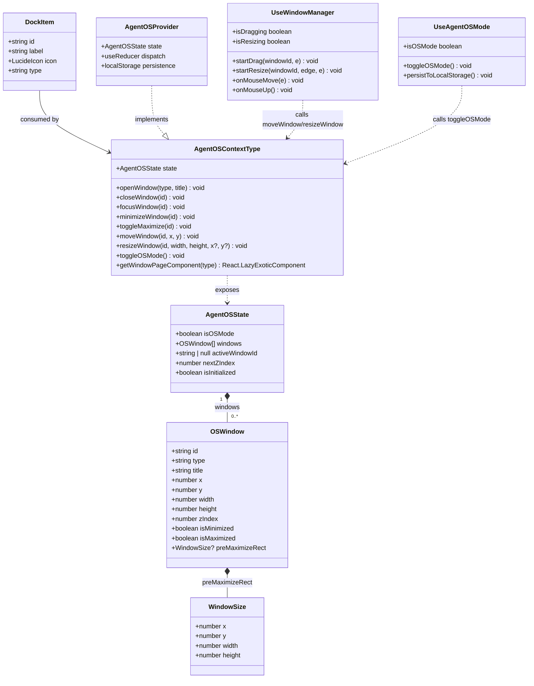
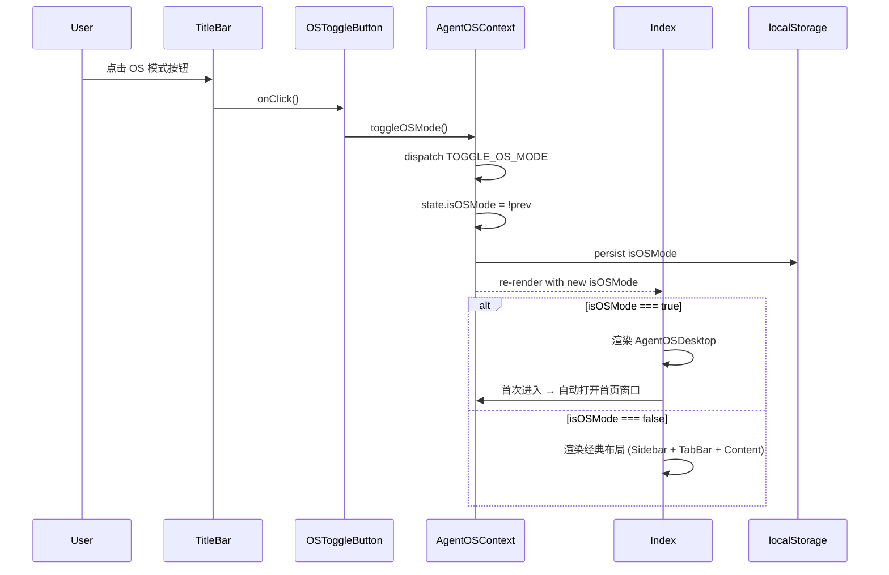
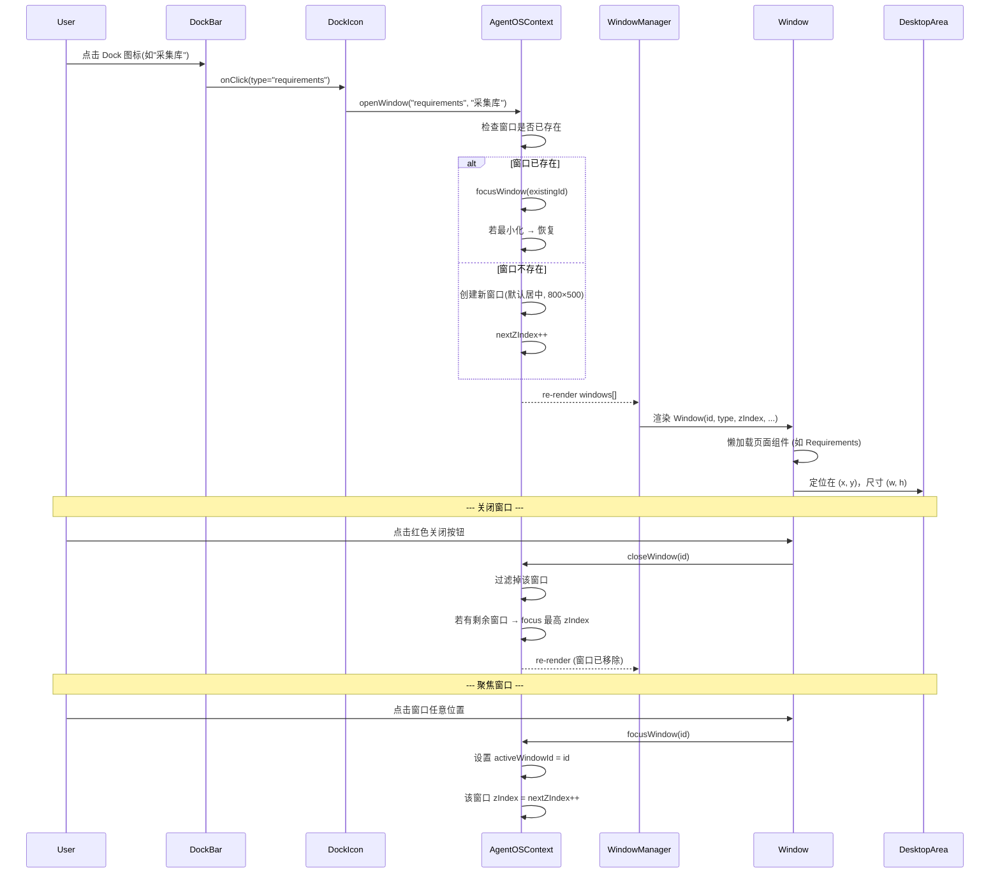
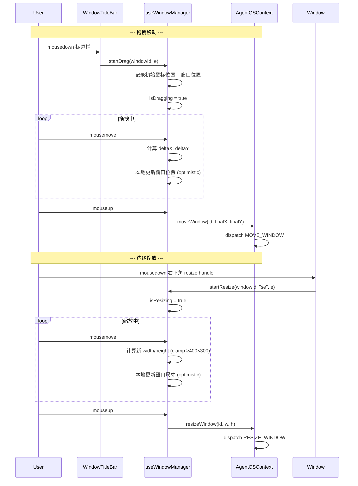
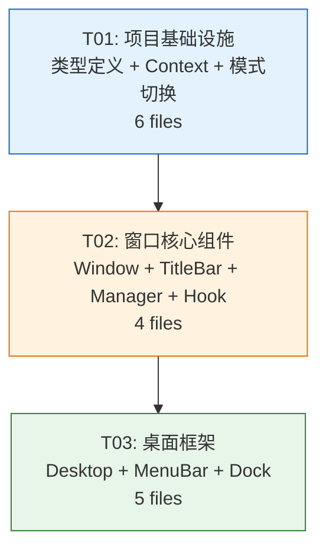

# System Design: Agent OS 桌面模式

> **架构师**: Bob | **日期**: 2025-07-15 | **状态**: Final

---

## Part A: System Design

### 1. Implementation Approach

#### 1.1 核心技术挑战

| 挑战 | 描述 | 难度 |
|------|------|------|
| 窗口 z-index 管理 | 多窗口点击切换层级，焦点高亮/非焦点变暗 | 中 |
| 窗口拖拽 & 缩放 | 标题栏拖拽移动、四角+边缘 resize，限制最小尺寸 400×300 | 中 |
| 模式切换状态保留 | 经典模式 ←→ OS 模式，保持窗口/标签页状态不丢失 | 高 |
| 现有 TabBar 适配 | OS 模式下全局 TabBar 变为窗口内局部 TabBar | 高 |
| 暗色模式全覆盖 | 所有新组件使用 --wiki-* CSS 变量 | 低 |

#### 1.2 框架 & 库选型

| 方面 | 选型 | 理由 |
|------|------|------|
| UI 框架 | React 19（现有） | 无需引入新框架 |
| 样式方案 | Tailwind CSS v4 + CSS 变量 | 复用现有体系，降低学习成本 |
| 图标库 | lucide-react（现有） | 侧边栏图标直接映射到 Dock |
| 状态管理 | React Context + useReducer | 窗口状态复杂度适中，无需 Redux |
| 拖拽实现 | 原生 DOM 事件（mousedown/mousemove/mouseup） | 零依赖，精确控制，避免引入 react-dnd 等重型库 |
| 持久化 | localStorage | 模式偏好 + 窗口布局持久化 |
| 类型定义 | TypeScript（现有） | 强类型约束 |

#### 1.3 架构模式

采用 **Provider + Hook 模式**：

```
App.tsx
  └── AuthProvider
       └── ThemeProvider
            └── AgentOSProvider        ← 新增
                 └── Index.tsx
                      ├── [经典模式] TitleBar + Sidebar + Content
                      └── [OS模式]   TitleBar(含Toggle) + AgentOSDesktop
```

**关键原则**：
- AgentOSContext 在经典模式下保持休眠（不渲染桌面组件），但状态保留
- 模式切换只影响 Index.tsx 的渲染分支，不卸载全局 Context
- 窗口内容复用现有 lazy-loaded 页面组件，零改动

---

### 2. File List

```
src/
├── types/
│   └── agent-os.ts                    # [新增] OS模式类型定义
├── context/
│   └── AgentOSContext.tsx             # [新增] OS模式全局状态Context
├── hooks/
│   ├── useAgentOSMode.ts             # [新增] OS模式切换hook + localStorage持久化
│   └── useWindowManager.ts           # [新增] 窗口CRUD + 拖拽/缩放逻辑
├── components/
│   ├── agent-os/
│   │   ├── AgentOSDesktop.tsx        # [新增] 桌面主容器(MenuBar + DesktopArea + DockBar)
│   │   ├── MenuBar.tsx               # [新增] 顶部菜单栏(28px)
│   │   ├── DesktopArea.tsx           # [新增] 桌面区域(窗口画布)
│   │   ├── DockBar.tsx               # [新增] Dock栏(64px, glassmorphism)
│   │   ├── DockIcon.tsx              # [新增] 单个Dock图标
│   │   ├── WindowManager.tsx         # [新增] 窗口管理器(协调渲染)
│   │   ├── Window.tsx                # [新增] 单个窗口组件
│   │   ├── WindowTitleBar.tsx        # [新增] 窗口标题栏(36px, macOS按钮)
│   │   └── OSToggleButton.tsx        # [新增] 模式切换按钮
│   └── TitleBar.tsx                  # [修改] 添加OSToggleButton插槽
├── pages/
│   └── Index.tsx                     # [修改] 添加OS模式渲染分支
```

---

### 3. Data Structures and Interfaces

> See also: `docs/class-diagram.mermaid`



**TypeScript 类型定义** (`src/types/agent-os.ts`):

```typescript
import type { LucideIcon } from 'lucide-react';

/** 窗口尺寸（用于全屏恢复） */
export interface WindowRect {
  x: number;
  y: number;
  width: number;
  height: number;
}

/** 单个 OS 窗口 */
export interface OSWindow {
  id: string;
  type: string;          // 对应 MENU_MAP 的 type
  title: string;
  x: number;
  y: number;
  width: number;
  height: number;
  zIndex: number;
  isMinimized: boolean;
  isMaximized: boolean;
  preMaximizeRect: WindowRect | null;  // 全屏前的位置/大小
}

/** Dock 栏图标项 */
export interface DockItem {
  id: string;
  label: string;
  icon: LucideIcon;
  type: string;          // 映射到 MENU_MAP.type
}

/** OS 模式全局状态 */
export interface AgentOSState {
  isOSMode: boolean;
  windows: OSWindow[];
  activeWindowId: string | null;
  nextZIndex: number;
  isInitialized: boolean;  // 防止 hydration mismatch
}

/** Reducer Action 类型 */
export type AgentOSAction =
  | { type: 'TOGGLE_OS_MODE' }
  | { type: 'INIT_FROM_STORAGE'; payload: { isOSMode: boolean; windows: OSWindow[]; nextZIndex: number } }
  | { type: 'OPEN_WINDOW'; payload: { type: string; title: string } }
  | { type: 'CLOSE_WINDOW'; payload: { id: string } }
  | { type: 'FOCUS_WINDOW'; payload: { id: string } }
  | { type: 'MINIMIZE_WINDOW'; payload: { id: string } }
  | { type: 'TOGGLE_MAXIMIZE'; payload: { id: string; desktopRect: WindowRect } }
  | { type: 'MOVE_WINDOW'; payload: { id: string; x: number; y: number } }
  | { type: 'RESIZE_WINDOW'; payload: { id: string; width: number; height: number; x?: number; y?: number } };

/** 窗口页面组件 Map */
export type WindowPageMap = Record<string, React.LazyExoticComponent<React.ComponentType<any>>>;
```

---

### 4. Program Call Flow

> See also: `docs/sequence-diagram.mermaid`

#### 4.1 模式切换流程



#### 4.2 窗口打开/关闭/聚焦流程



#### 4.3 窗口拖拽与缩放流程



---

### 5. Anything UNCLEAR

| # | 问题 | 假设/处理方式 |
|---|------|---------------|
| 1 | 全屏窗口是否需要覆盖 Dock 栏？ | **假设**：不覆盖。全屏窗口铺满 DesktopArea（即 MenuBar 下方、Dock 上方），保留 Dock 栏可见 |
| 2 | 窗口关闭后，该窗口内的浏览器 webview 是否需要销毁？ | **假设**：销毁。窗口关闭 = 组件卸载 = webview 销毁。与现有浏览器 Tab 行为一致 |
| 3 | OS 模式下是否需要支持 TabBar 内的子 Tab（如需求详情）？ | **假设**：支持。每个窗口内部独立维护自己的 TabBar，复用现有 openTab/closeTab 逻辑 |
| 4 | 窗口布局（位置/大小）是否需要在刷新后恢复？ | **假设**：是。通过 localStorage 持久化，但窗口内容（具体打开哪个页面）不持久化 |
| 5 | Dock 栏图标的"运行中"指示器（macOS 小黑点）是否需要？ | **假设**：需要。已有窗口打开的 Dock 图标下方显示圆点指示器，关闭后消失 |

---

## Part B: Task Decomposition

### 6. Required Packages

**无新增第三方依赖！** 全部基于现有依赖实现：

```
- react@^19.2.0:          UI框架（现有）
- lucide-react@^0.555.0:  图标库（现有，Dock图标复用Sidebar图标）
- tailwindcss@^4.1.17:    样式框架（现有）
- TypeScript@~5.9.3:      类型检查（现有）
```

> 窗口拖拽/缩放使用原生 DOM 事件，不需要额外库。
> Dock 栏 glassmorphism 效果使用 Tailwind backdrop-blur 工具类。

---

### 7. Task List (ordered by dependency)

| Task ID | Task Name | Source Files | Dependencies | Priority |
|---------|-----------|-------------|-------------|----------|
| **T01** | 项目基础设施：类型定义 + Context + 模式切换 | `src/types/agent-os.ts`, `src/context/AgentOSContext.tsx`, `src/hooks/useAgentOSMode.ts`, `src/components/agent-os/OSToggleButton.tsx`, `src/components/TitleBar.tsx` (modify), `src/pages/Index.tsx` (modify) | 无 | P0 |
| **T02** | 窗口核心组件：Window + WindowTitleBar + WindowManager | `src/components/agent-os/Window.tsx`, `src/components/agent-os/WindowTitleBar.tsx`, `src/components/agent-os/WindowManager.tsx`, `src/hooks/useWindowManager.ts` | T01 | P0 |
| **T03** | 桌面框架：AgentOSDesktop + MenuBar + DesktopArea + DockBar + DockIcon | `src/components/agent-os/AgentOSDesktop.tsx`, `src/components/agent-os/MenuBar.tsx`, `src/components/agent-os/DesktopArea.tsx`, `src/components/agent-os/DockBar.tsx`, `src/components/agent-os/DockIcon.tsx` | T02 | P0 |

**共计 3 个任务**（符合 ≤5 硬性限制）。

---

### T01 详细说明：项目基础设施

**目标**：建立 AgentOS 的类型系统、全局状态管理和模式切换机制，打通经典模式 ←→ OS 模式的切换通道。

**具体工作**：

1. **`src/types/agent-os.ts`** — 定义所有核心类型：
   - `OSWindow`, `WindowRect`, `AgentOSState`, `AgentOSAction`, `DockItem`, `WindowPageMap`
   - 导出 reducer 函数 `agentOSReducer(state, action): AgentOSState`
   - 导出初始状态工厂 `createInitialState(): AgentOSState`

2. **`src/context/AgentOSContext.tsx`** — 全局 Context Provider：
   - 使用 `useReducer` 管理 `AgentOSState`
   - 提供 `openWindow`, `closeWindow`, `focusWindow`, `minimizeWindow`, `toggleMaximize`, `moveWindow`, `resizeWindow`, `toggleOSMode` 方法
   - `openWindow` 实现：已存在同 type 窗口 → focus + 恢复最小化；不存在 → 创建新窗口（默认居中 800×500）
   - `toggleOSMode` 实现：首次进入 OS 模式时自动调用 `openWindow('home', '首页')`
   - localStorage 读写：
     - Key: `agent-os-mode` → `isOSMode: boolean`
     - Key: `agent-os-windows` → `{ windows: OSWindow[], nextZIndex: number }`
   - 窗口页面组件映射：复用 Index.tsx 中的 lazy() 组件定义（通过 import 或 prop 注入）

3. **`src/hooks/useAgentOSMode.ts`** — 便捷 hook：
   - 从 AgentOSContext 提取 `isOSMode` + `toggleOSMode`
   - `useEffect` 首次挂载时从 localStorage 读取模式偏好

4. **`src/components/agent-os/OSToggleButton.tsx`** — 切换按钮：
   - 使用 lucide-react 的 `MonitorIcon`（OS模式）和 `LayoutIcon`（经典模式）
   - `aria-label="切换到桌面模式"` / `"切换到经典模式"`
   - 样式：`w-11 h-full flex items-center justify-center hover:bg-wiki-surface2`

5. **`src/components/TitleBar.tsx`** (修改) — 添加模式切换按钮插槽：
   - 新增 prop: `onToggleOSMode?: () => void; isOSMode?: boolean`
   - 在现有窗口控制按钮区域（browser 按钮前或后）渲染 `<OSToggleButton>`
   - 保持 WebkitAppRegion: 'no-drag'

6. **`src/pages/Index.tsx`** (修改) — 添加 OS 模式渲染分支：
   - 从 AgentOSContext 读取 `isOSMode`
   - `{isOSMode ? <AgentOSDesktop /> : <经典布局>}`
   - TitleBar 传入 `isOSMode` + `onToggleOSMode`
   - OS 模式下隐藏 Sidebar，TitleBar 仅保留切换按钮 + 窗口控制按钮（不显示 TabBar）
   - 非 OS 模式行为完全不变

**关键约束**：
- 模式切换不丢失经典模式的 tabs 状态（tabs/activeTabId 在 Index.tsx 中保留）
- 首次初始化从 localStorage 读取，默认 `isOSMode = false`
- OS 模式关闭所有窗口时，不自动退出 OS 模式（桌面保持空白）

---

### T02 详细说明：窗口核心组件

**目标**：实现可拖拽、可缩放、可最小化、可全屏的独立窗口组件，以及窗口管理器。

**具体工作**：

1. **`src/hooks/useWindowManager.ts`** — 拖拽 & 缩放核心逻辑：
   - `startDrag(windowId, mouseEvent)`：
     - 记录初始鼠标位置 (`startX`, `startY`)
     - 记录初始窗口位置 (`initialWindowX`, `initialWindowY`)
     - `isDragging = true`
   - `startResize(windowId, edge, mouseEvent)`：
     - edge: `'n' | 's' | 'e' | 'w' | 'ne' | 'nw' | 'se' | 'sw'`
     - 记录初始鼠标位置 + 窗口位置/尺寸
     - `isResizing = true`
   - `onMouseMove(e)`:
     - 拖拽：计算 delta，本地更新 window 位置（optimistic ref 更新，不触发 re-render）
     - 缩放：根据 edge 计算新 width/height/x/y，clamp 最小值 400×300
   - `onMouseUp()`:
     - 拖拽/缩放结束，调用 `moveWindow` / `resizeWindow`，同步到 Context
     - `isDragging = false`, `isResizing = false`
   - `onDoubleClickTitleBar(windowId)`:
     - 调用 `toggleMaximize`
   - 返回 `{ startDrag, startResize, onMouseMove, onMouseUp, isDragging, isResizing }`
   - 事件监听：`mousemove`/`mouseup` 绑定到 `document`（避免鼠标移出窗口后失效）

2. **`src/components/agent-os/WindowTitleBar.tsx`** — macOS 风格标题栏：
   - Props: `{ title: string; isFocused: boolean; onClose: () => void; onMinimize: () => void; onMaximize: () => void; onMouseDown: (e) => void }`
   - 高度 36px，背景 `var(--wiki-surface)`，底部 `1px solid var(--wiki-border)`
   - 左侧：三个圆点按钮（12px 直径）
     - 红色 `#FF5F57`：关闭（hover 显示 × 图标）
     - 黄色 `#FFBD2E`：最小化（hover 显示 − 图标）
     - 绿色 `#28CA41`：全屏（hover 显示 ↖ 图标）
   - 中央：标题文字 `var(--wiki-text2)`，13px，`pointer-events: none`
   - 非焦点窗口：标题栏整体 opacity 降低至 0.6
   - `cursor: grab` on titlebar, `cursor: grabbing` when dragging

3. **`src/components/agent-os/Window.tsx`** — 单个窗口：
   - Props: `{ window: OSWindow; isFocused: boolean; onClose: () => void; onFocus: () => void; onMinimize: () => void; onMaximize: () => void }`
   - 外层 div：`position: absolute`, `left/top/width/height`, `zIndex`
   - 圆角 8px，阴影 `0 8px 32px rgba(0,0,0,0.12)`（暗色 `rgba(0,0,0,0.4)`）
   - 背景 `var(--wiki-bg)`
   - 非焦点窗口：整体 opacity 轻微降低（标题栏效果）
   - 渲染 `<WindowTitleBar>` + 内容区
   - 内容区：`flex-1 overflow-hidden`，嵌入懒加载页面组件
   - resize handles：四角（8px）+ 四边（4px），`cursor: nw-resize` 等
   - 最小化时渲染 null（`display: none`）
   - 全屏时：`left: 0, top: 0, width: 100%, height: 100%`（相对于 DesktopArea）
   - `onMouseDown` → `onFocus()`

4. **`src/components/agent-os/WindowManager.tsx`** — 窗口管理器：
   - 从 AgentOSContext 读取 `windows` + `activeWindowId`
   - 渲染所有未最小化的 `<Window>` 组件
   - 按 zIndex 排序渲染
   - 使用 `useWindowManager` hook 管理全局拖拽/缩放事件
   - 将 drag/resize handlers 传递给每个 Window
   - 页面组件映射：根据 `window.type` 懒加载对应页面（同 Index.tsx 的 switch-case 逻辑）
   - 每个窗口内嵌独立 TabBar（对于需要 TabBar 的页面类型如 requirements）

---

### T03 详细说明：桌面框架

**目标**：组装完整的桌面环境 —— 菜单栏 + 桌面画布 + Dock 栏，提供完整的 macOS 风格交互体验。

**具体工作**：

1. **`src/components/agent-os/MenuBar.tsx`** — 顶部菜单栏：
   - 高度 28px，背景 `var(--wiki-surface)`，底部 `1px solid var(--wiki-border)`
   - 左侧：Apple logo 占位（`` 或 SVG），不可点击
   - 菜单项（仅展示，不可点击）：`Workit` `文件` `编辑` `视图` `窗口` `帮助`
   - 字体 13px，`var(--wiki-text2)`，间距 16px
   - 右侧：时间显示（`new Date().toLocaleTimeString('zh-CN', {hour:'2-digit',minute:'2-digit'})`），每秒更新
   - 注意：使用 `useEffect` + `setInterval` 更新时间，组件卸载时清理

2. **`src/components/agent-os/DesktopArea.tsx`** — 桌面区域：
   - `flex-1`，背景 `var(--wiki-bg)`
   - `position: relative; overflow: hidden`
   - 作为 `<WindowManager>` 的容器
   - Style: 可设置桌面壁纸色（`var(--wiki-bg)` 足够）

3. **`src/components/agent-os/DockBar.tsx`** — 底部 Dock 栏：
   - 高度 64px，水平居中，`position: absolute; bottom: 8px; left: 50%; transform: translateX(-50%)`
   - 背景：`rgba(255,255,255,0.72)` + `backdrop-filter: blur(20px)`（暗色 `rgba(0,0,0,0.72)`）
   - 圆角 16px，边框 `1px solid var(--wiki-border)`
   - 内边距：`px-2 py-1.5`
   - 包含所有 `<DockIcon>` 组件
   - Dock 图标列表复用 Sidebar 的 `navItems` 结构 + 额外添加 `settings`, `profile`

4. **`src/components/agent-os/DockIcon.tsx`** — 单个 Dock 图标：
   - Props: `{ item: DockItem; isOpen: boolean; onClick: () => void }`
   - 图标 40×40px，圆角 10px，间距 4px（margin）
   - hover: `transform: scale(1.2)` + `transition-transform duration-200`
   - 使用 lucide-react 图标组件，颜色 `var(--wiki-text)`
   - 下方运行指示器（`isOpen` 为 true）：4px 圆点，`var(--wiki-text3)`
   - tooltip：hover 显示名称（复用 Sidebar 的 tooltip 样式）

5. **`src/components/agent-os/AgentOSDesktop.tsx`** — 桌面主容器：
   - 组合：`<MenuBar>` + `<DesktopArea>`（内含 `<WindowManager>`）+ `<DockBar>`
   - 高度 `100%`（填充 Index.tsx 中的 flex-1 空间）
   - `flex flex-col`
   - 从 AgentOSContext 读取状态，传给子组件
   - 构建 `dockItems` 数组：
     ```typescript
     const dockItems: DockItem[] = [
       { id: 'home', label: '首页', icon: HomeIcon, type: 'home' },
       { id: 'requirements', label: '采集库', icon: SparklesIcon, type: 'requirements' },
       { id: 'knowledge', label: '知识库', icon: DatabaseIcon, type: 'knowledge' },
       { id: 'insights', label: '洞察分析', icon: LightbulbIcon, type: 'insights' },
       { id: 'mcp', label: '应用生态', icon: PackageIcon, type: 'mcp' },
       { id: 'model', label: '模型配置', icon: CpuIcon, type: 'model' },
       { id: 'messages', label: '消息中心', icon: MessageSquareIcon, type: 'messages' },
       { id: 'settings', label: '系统设置', icon: SettingsIcon, type: 'settings' },
       { id: 'profile', label: '用户Agent', icon: UserIcon, type: 'profile' },  // UserIcon from lucide-react
     ];
     ```
   - `isOpen` 判断：`windows.some(w => w.type === dockItem.type && !w.isMinimized)`

---

### 8. Shared Knowledge

跨文件约定，Engineer 实现时必须遵守：

```
## 命名规范
- 所有 AgentOS 组件文件使用 PascalCase
- CSS 类名优先使用 Tailwind utility class，自定义样式使用 inline style 绑定 --wiki-* 变量
- 事件处理函数以 `handle` 前缀命名（如 handleClose, handleFocus）

## CSS 变量使用约定
- 所有背景色使用 var(--wiki-bg) 或 var(--wiki-surface)
- 所有边框使用 var(--wiki-border)
- 所有主文字使用 var(--wiki-text)，次要文字 var(--wiki-text2)，三级文字 var(--wiki-text3)
- 暗色模式适配通过现有 .dark 类自动生效，无需额外处理
- ❌ 禁止硬编码颜色值（如 #ffffff, #000000），除非是 macOS 按钮颜色 #FF5F57/#FFBD2E/#28CA41

## 状态管理
- 窗口状态通过 AgentOSContext 统一管理
- useWindowManager 仅管理本地 drag/resize 临时状态，最终通过 Context dispatch 同步
- localStorage key 前缀统一为 "agent-os-"

## 组件懒加载
- 窗口内容页面复用 Index.tsx 中已有的 lazy() 导入
- 窗口打开时 Suspense fallback 为 Loading spinner（复用现有 Loading 组件）

## 事件处理
- 拖拽/缩放事件绑定到 document，mouseup 时解绑
- 所有 mousemove/mouseup 监听在组件卸载时必须清理（useEffect cleanup）
- 窗口 drag 区域仅限 WindowTitleBar，resize 区域为窗口边缘/角落

## TypeScript 严格模式
- 所有组件 Props 必须显式定义 interface
- 禁止使用 any，未知类型使用 unknown
- 回调函数类型使用具体签名而非 Function

## Electron 集成
- 仅使用现有 window.electronAPI（不新增 IPC 通道）
- OS 模式运行在同一个 BrowserWindow 内
- WebkitAppRegion: 'no-drag' 仅用于可交互按钮区域
```

---

### 9. Task Dependency Graph



**依赖链**：T01 → T02 → T03（线性依赖，每个任务完成后下一个才能开始）

---

## Appendix: Integration Impact Analysis

### 现有文件修改清单

| 文件 | 修改类型 | 影响范围 |
|------|----------|----------|
| `src/pages/Index.tsx` | 修改 | 添加 OS 模式渲染分支，约 +15 行 |
| `src/components/TitleBar.tsx` | 修改 | 新增 2 个 prop + 渲染 OSToggleButton，约 +8 行 |

### 零影响区域

- ✅ 所有页面组件（Home, Requirements, Knowledge 等）**零改动**
- ✅ Sidebar 组件**零改动**（OS 模式下通过 `isOSMode` 条件隐藏）
- ✅ AuthContext, ThemeContext **零改动**
- ✅ Electron 主进程**零改动**
- ✅ 现有 CSS 变量体系**零改动**

### CSS 变量映射表（OS模式组件 → 设计规格）

| 设计规格 | CSS 变量 |
|----------|----------|
| 桌面背景 | `var(--wiki-bg)` |
| 窗口/MenuBar/Dock 表面 | `var(--wiki-surface)` |
| 窗口标题栏背景 | `var(--wiki-surface)` |
| 边框 | `var(--wiki-border)` |
| 标题文字 | `var(--wiki-text2)` |
| 内容文字 | `var(--wiki-text)` |
| 暗色 Dock 背景 | `rgba(0,0,0,0.72)` (hardcoded, per spec) |
| 亮色 Dock 背景 | `rgba(255,255,255,0.72)` (hardcoded, per spec) |
| 窗口阴影(亮) | `0 8px 32px rgba(0,0,0,0.12)` |
| 窗口阴影(暗) | `0 8px 32px rgba(0,0,0,0.4)` |
